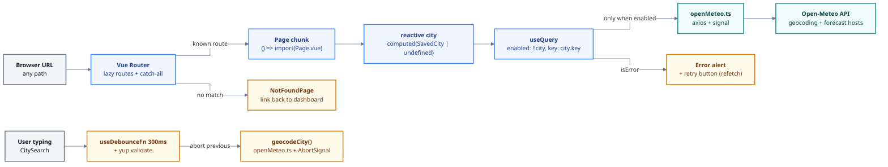

# Phase 5: Refactor & Hardening - Research

**Researched:** 2026-07-08
**Domain:** Vue 3 refactoring - reactive Vue Query composables, router hardening, VueUse debounce, vue-i18n v9 -> v11 migration, MSW API-layer tests
**Confidence:** HIGH (most findings verified against installed package sources/types or official docs; assumptions logged)

## Summary

Phase 5 is a hardening pass over existing, working v1.0 code. No new user-facing features beyond a 404 page and retry buttons; the work is: (1) make `useCurrentWeather`/`useForecast` accept a reactive city with an `enabled` guard, which deletes the CityDetailPage Proxy hack and the lat-0/lon-0 fetch; (2) lazy-load routes and add a catch-all 404; (3) replace CitySearch's hand-rolled `setTimeout` debounce with VueUse `useDebounceFn` plus explicit unmount cleanup; (4) delete WeatherCard's dead 404 error branch; (5) upgrade vue-i18n 9 -> 11; (6) add MSW-mocked tests for `openMeteo.ts` and component tests for CitySearch.

Three findings materially shape the plan. First, the installed TanStack Vue Query 5.101 types confirm the exact reactive pattern: `useQuery` options fields are `MaybeRefDeep`, and `enabled` specifically accepts `MaybeRefOrGetter<boolean | undefined>` - so `queryKey: computed(...)` + `enabled: () => !!toValue(city)` is the supported, idiomatic fix [VERIFIED: installed types]. Second, VueUse 14.3.0's `useDebounceFn` returns ONLY a promisified function - no `cancel()`, no `flush()`, and no automatic scope-dispose cleanup (verified by reading the installed dist source); the plan must add manual `onScopeDispose` cleanup (disposed flag + `AbortController.abort()`), and must NOT rely on doc claims of a `.cancel()` method. Third, the vue-i18n migration is near drop-in for this codebase: all v10/v11 breaking changes hit Legacy API mode, `tc`/`$tc`, `v-t`, `allowComposition`, and modulo interpolation - a grep confirms none are used here (`legacy: false`, plain `t()` calls, TS message objects). The one hard gate is vue-i18n@11.4.6 requires Node >= 22; the local machine runs Node v22.14.0, so this passes.

**Primary recommendation:** Plan four independent work streams (composables+retry, router, CitySearch+WeatherCard cleanup, i18n upgrade) and land the MSW/API tests plus CitySearch tests alongside the code they lock down. Run `openMeteo.ts` MSW tests in a per-file `node` environment to sidestep jsdom interception friction; keep `vi.mock('@/lib/openMeteo')` (not MSW) for the CitySearch component tests, matching the existing test suite's pattern.

## Project Constraints (from CLAUDE.md)

- Tech stack fixed: Vue 3 + TypeScript + Vite (this is the thing being learned).
- Data source: Open-Meteo API only, no API key.
- Frontend only; no backend.
- Readability over cleverness - study artifact; code carries teaching comments (existing convention in every file).
- Dependencies: ask before adding anything beyond the agreed list. For this phase the approved new dependency is `msw` (dev) only. `vuedraggable` and `@playwright/test` are approved but belong to Phase 7 - do NOT install them in Phase 5. `@intlify/unplugin-vue-i18n` is NOT approved - do not add it.
- All file edits must go through a GSD workflow (this research is part of `/gsd-plan-phase`).
- User global rule: never use the em-dash character in authored content; use "-".

<phase_requirements>
## Phase Requirements

| ID | Description | Research Support |
|----|-------------|------------------|
| DATA-04 | Composables accept reactive city (`MaybeRefOrGetter<SavedCity \| undefined>`) with `enabled` guard; no fetch when unresolved; removes Proxy hack + null-island fetch | Verified `useQuery` reactive types + exact composable pattern (Code Examples 1); pitfall 1-2 cover typing and prop reactivity |
| DATA-05 | Retry button on failed weather/forecast load via Vue Query `refetch` | `refetch` is on `UseQueryReturnType`; wire pattern in Code Example 2; new i18n keys needed (en/ja parity) |
| NAV-04 | Page routes lazy-loaded, each page its own chunk | `() => import()` per route; Vite auto-names chunks per file; verify via `npm run build` output (Architecture Pattern 2) |
| NAV-05 | Unknown URL shows friendly 404 with link back | Catch-all `/:pathMatch(.*)*` route, placed last; new `NotFoundPage.vue` + i18n keys (Code Example 3) |
| SRCH-04 | CitySearch debounce via `useDebounceFn` with proper cleanup on unmount | Verified 14.3.0 semantics (no cancel, no auto-cleanup); manual `onScopeDispose` pattern (Code Example 4) |
| WTHR-03 | Remove dead 404 "city not found" branch from WeatherCard error mapping | Branch located at WeatherCard.vue lines 33-41; removal plan incl. `card.notFound` key cleanup (both locales) |
| I18N-03 | vue-i18n v9 -> v11, no deprecation warning, behavior intact | Breaking-change audit vs codebase (all clear); Node >= 22 gate passes; install + verify steps in State of the Art |
| TEST-04 | `openMeteo.ts` covered by MSW tests (success, empty, error shapes) | MSW v2 node setup, per-file node environment, handler + error-shape patterns (Code Example 5) |
| TEST-05 | CitySearch tests: debounce, abort-on-new-input, select-clears-field | Fake-timer strategy (`advanceTimersByTimeAsync`), vi.mock signal capture, Vuetify mount shims (Code Example 6) |
</phase_requirements>

## Architectural Responsibility Map

| Capability | Primary Tier | Secondary Tier | Rationale |
|------------|-------------|----------------|-----------|
| Reactive query gating (`enabled`) | Browser/Client - composables (`src/composables/`) | - | Server-state orchestration is Vue Query's job inside composables; pages only pass a reactive city |
| Retry on error | Browser/Client - components (WeatherCard, CityDetailPage) | Composables expose `refetch` | UI affordance calls the composable's returned `refetch`; no new fetch logic |
| Route code-splitting + 404 | Browser/Client - router (`src/router/index.ts`) | Vite build (chunking) | Router owns navigation; Vite owns chunk emission |
| Debounce + abort | Browser/Client - CitySearch component | `src/lib/openMeteo.ts` accepts `AbortSignal` | Debounce is view-layer input shaping; the HTTP layer already threads signals |
| i18n runtime | Browser/Client - `src/i18n/` plugin | Build (esm-bundler flags, optional) | Library upgrade; message files unchanged |
| API mocking for tests | Test tier - Vitest node process | - | MSW `setupServer` intercepts Node http; never ships in the app bundle |

## Standard Stack

### Core

| Library | Version | Purpose | Why Standard |
|---------|---------|---------|--------------|
| vue-i18n | ^11.4.6 (upgrade from ^9.14.5) | UI translation | v9 is npm-deprecated; v11 is the current maintained line [VERIFIED: npm registry, 11.4.6 published 2026-06-18] |
| msw | ^2.14.6 (new, dev) | API-layer test mocking via `msw/node` `setupServer` | The de-facto standard request mocker; user-approved dep [VERIFIED: npm registry + official docs mswjs.io] |
| @tanstack/vue-query | ^5.101.0 (already installed) | Reactive server state | Already in stack; installed types confirm reactive `queryKey`/`enabled` support [VERIFIED: installed types] |
| @vueuse/core | ^14.3.0 (already installed) | `useDebounceFn` | Already in stack; 14.3.0 is npm latest [VERIFIED: npm registry] |
| vue-router | ^5.1.0 (already installed) | Lazy routes + catch-all 404 | Already in stack; docs syntax applies [CITED: router.vuejs.org] |

### Supporting

| Library | Version | Purpose | When to Use |
|---------|---------|---------|-------------|
| vitest | ^4.1.8 (installed) | Test runner; `vi.useFakeTimers` + `advanceTimersByTimeAsync` for debounce tests | TEST-04/TEST-05 |
| @vue/test-utils | ^2.4.11 (installed) | Component mounting | TEST-05 |

### Alternatives Considered

| Instead of | Could Use | Tradeoff |
|------------|-----------|----------|
| MSW for `openMeteo.ts` tests | axios adapter mocks / `vi.mock('axios')` | Adapter mocks don't exercise real URL/param serialization or axios error shaping; MSW tests the actual HTTP boundary and is the approved learning target |
| Per-file MSW `setupServer` in the spec | Global `setupFiles` entry in vitest.config.ts | Global setup loads MSW into every spec (component specs mock the module instead and never hit HTTP); per-file keeps it contained and readable for a study project |
| `@intlify/unplugin-vue-i18n` precompile | Runtime JIT compile (default) | Plugin is a NEW dependency (not approved) and unnecessary at this message volume; skip it |

**Installation:**
```bash
npm install vue-i18n@^11.4.6
npm install -D msw@^2.14.6
```

**Version verification (done this session):**
```bash
npm view vue-i18n version        # 11.4.6
npm view msw version             # 2.14.6
npm view @vueuse/core version    # 14.3.0 (matches installed)
npm view @tanstack/vue-query version  # 5.101.2 (installed 5.101.0 in range; no upgrade required)
node --version                   # v22.14.0 (vue-i18n@11 engines: node >= 22 - PASSES)
```

## Package Legitimacy Audit

Ran `gsd-tools query package-legitimacy check --ecosystem npm msw vue-i18n` plus manual registry checks.

| Package | Registry | Age | Downloads | Source Repo | Verdict | Disposition |
|---------|----------|-----|-----------|-------------|---------|-------------|
| msw | npm | since 2018-11-18 | 16.9M/wk | github.com/mswjs/msw | [SLOP per seam heuristic - see note] | Flagged - planner adds checkpoint:human-verify before install |
| vue-i18n | npm | long-established (intlify) | 3.2M/wk | github.com/intlify/vue-i18n | [SUS per seam heuristic - "too-new"] | Flagged - planner adds checkpoint:human-verify before install |

**Seam verdict analysis (important context for the planner):**

- `msw` was flagged `SLOP` with reason `suspicious-postinstall`. The signals in the SAME seam output show a package created in 2018 with 16.9M weekly downloads and the official `mswjs/msw` repo. Its postinstall is `node -e "import('./config/scripts/postinstall.js').catch(() => void 0)"` - this is MSW's documented, long-standing postinstall (worker-script auto-update support and support message), shipped from the official repo. This is a heuristic false positive on the postinstall pattern, not a hallucinated package. However, per protocol the flag stands: the planner must gate the `npm install -D msw` step behind a `checkpoint:human-verify` task, and the executor should confirm the installed package resolves to the `mswjs/msw` repository. Note also that `msw` is a USER-APPROVED dependency named explicitly in `.planning/REQUIREMENTS.md`.
- `vue-i18n` was flagged `SUS` with reason `too-new` because 11.4.6 published 2026-06-18 (recent release on an actively maintained package). Same treatment: gate the upgrade behind human-verify; confirm resolution to `intlify/vue-i18n`.

**Packages removed due to genuine [SLOP] verdict:** none (no hallucinated packages recommended).
**Packages flagged:** msw, vue-i18n (both heuristic flags on official packages; human-verify checkpoint required before install/upgrade).

`msw` postinstall check: `npm view msw scripts.postinstall` returns the script above - it imports a script bundled inside the package itself, no external network/filesystem paths [VERIFIED: npm registry].

**Do NOT run `npx msw init`.** That generates `public/mockServiceWorker.js` for browser mocking. Phase 5 only uses `msw/node` in tests; nothing MSW-related may enter the app bundle or `public/`.

## Architecture Patterns

### System Architecture Diagram

Note: the init block below renders correctly on GitHub; the local VS Code mermaid preview extension shows a blank box on any init directive (known limitation), so preview locally without the first line if needed.



In tests, the Open-Meteo boundary is replaced by MSW `setupServer` (node interceptors on axios's http adapter); components under test keep using `vi.mock('@/lib/openMeteo')`.

### Recommended Project Structure (additions only)

```
src/
├── pages/
│   └── NotFoundPage.vue        # NAV-05 (new)
├── composables/
│   ├── useCurrentWeather.ts    # DATA-04 (rework signature)
│   └── useForecast.ts          # DATA-04 (rework signature)
├── __tests__/
│   ├── openMeteo.spec.ts       # TEST-04 (new, node environment, MSW)
│   ├── citySearch.spec.ts      # TEST-05 (new, jsdom, vi.mock + fake timers)
│   └── msw/
│       └── handlers.ts         # shared Open-Meteo handlers (new)
```

### Pattern 1: Reactive composable with `enabled` guard (DATA-04)

**What:** Composables take `MaybeRefOrGetter<SavedCity | undefined>`, unwrap with `toValue()` inside `computed`s, and gate fetching with `enabled`.
**When to use:** Any query whose input may be unresolved (route param lookup) or may change reactively.
Verified against installed `@tanstack/vue-query` 5.101.0 type declarations: `useQuery(options: MaybeRefOrGetter<UseQueryOptions<...>>)`; inside options, `enabled` is `MaybeRefOrGetter<boolean | undefined>` (or a query callback) and every other field is `MaybeRefDeep` - so a `computed` queryKey re-keys the query reactively [VERIFIED: node_modules/@tanstack/vue-query/build/modern/_tsup-dts-rollup.d.ts lines 840, 854-856].

### Pattern 2: Route-level code splitting + catch-all (NAV-04/05)

**What:** Every page uses `component: () => import('@/pages/X.vue')`; a final route `{ path: '/:pathMatch(.*)*', name: 'not-found', component: ... }` catches everything else [CITED: router.vuejs.org/guide/advanced/lazy-loading.html, router.vuejs.org/guide/essentials/dynamic-matching.html].
**When to use:** All three existing pages plus NotFoundPage. Vite emits one chunk per lazily imported file, named after the file (e.g. `dist/assets/CityDetailPage-[hash].js`). Do not wrap route components in `defineAsyncComponent` - lazy routes are a distinct mechanism [CITED: router.vuejs.org].

### Pattern 3: Per-file test environment override (TEST-04)

**What:** `openMeteo.spec.ts` opens with a `// @vitest-environment node` docblock so it runs in Node instead of the config-wide jsdom. Pure HTTP-layer tests need no DOM; in the node environment axios uses its http adapter, which MSW's ClientRequest interceptor handles reliably. [ASSUMED: docblock syntax valid in Vitest 4 - long-standing Vitest feature, verify on first run]
**When to use:** TEST-04 only. Component tests stay in jsdom.

### Anti-Patterns to Avoid

- **Proxy-as-reactive-argument** (current CityDetailPage lines 34-53): passing a `Proxy` with a getter trap to fake reactivity. Replaced wholesale by Pattern 1 - delete `queryCity`, the `watch`, and the `Proxy`.
- **Placeholder-value fetching**: the `{ latitude: 0, longitude: 0 }` fallback city fires a real request for "null island." `enabled` is the correct gate; never fetch with sentinel coordinates.
- **Relying on `useDebounceFn().cancel()`**: the installed 14.3.0 return type is `PromisifyFn<T>` - a bare promisified function with NO `cancel`/`flush`/`isPending`, and NO automatic cleanup on scope dispose [VERIFIED: node_modules/@vueuse/shared/dist/index.d.ts line 1162 and dist/index.js lines 302-357, 776-778]. Current vueuse.org docs text suggesting cancel/flush exists conflicted with the installed source; the installed source wins for planning.
- **MSW in the browser bundle**: importing from `msw` anywhere outside test files, or running `msw init`. Node-only usage for this phase.
- **Testing debounce with real timers**: `setTimeout(350)` sleeps make slow, flaky tests. Use fake timers with the async advance API.

## Don't Hand-Roll

| Problem | Don't Build | Use Instead | Why |
|---------|-------------|-------------|-----|
| Debounce | `setTimeout`/`clearTimeout` bookkeeping (current CitySearch) | VueUse `useDebounceFn` | This is SRCH-04's whole point; the lib handles timer reset + promisification |
| Conditional fetching | Proxy hacks, placeholder cities, manual `watch`+imperative fetch | Vue Query `enabled` + reactive `queryKey` | Supported first-class in the installed version; caching/dedup/abort come free |
| Retry | Custom retry state machines | Vue Query `refetch()` from the query result | Already returned by `useQuery`; one button wire-up |
| HTTP mocking in tests | Hand-rolled axios adapter stubs | MSW `setupServer` | Exercises real URL/param/error serialization; approved dep |
| 404 matching | Router `beforeEach` guards inspecting `matched.length` | `/:pathMatch(.*)*` catch-all route | Official mechanism, zero guard code |

**Key insight:** every problem in this phase has a first-class API in a library already installed (or approved). The phase is about deleting hand-rolled code, not writing more of it.

## Runtime State Inventory

This is a refactor phase; audited all five categories:

| Category | Items Found | Action Required |
|----------|-------------|------------------|
| Stored data | `localStorage` keys `weather-prefs`, saved cities - key names and shapes are NOT touched by any Phase 5 change (i18n upgrade reads the same `weather-prefs`) | None - verified by reading `src/i18n/index.ts` and stores; no schema/key rename in scope |
| Live service config | None - no external services with config (Open-Meteo is anonymous/stateless) | None |
| OS-registered state | None - no scheduled tasks, services, or global installs reference this project | None |
| Secrets/env vars | None - project has no secrets or env vars (no API key by design) | None |
| Build artifacts | `dist/` (if present) becomes stale after lazy-loading change; `package-lock.json` changes with installs | `npm run build` regenerates; commit lockfile with the dep changes |

## Common Pitfalls

### Pitfall 1: `toValue(city)` is `undefined` inside `queryFn` per the types
**What goes wrong:** With `MaybeRefOrGetter<SavedCity | undefined>`, TypeScript flags `toValue(city).latitude` in the queryFn even though `enabled` guarantees a city at runtime.
**Why it happens:** `enabled` is a runtime gate; TS cannot narrow across it.
**How to avoid:** In the queryFn: `const c = toValue(city); if (!c) throw new Error('query should be disabled without a city'); ...`. Readable, safe, and teaches why the guard exists (better than `!` for a study project).
**Warning signs:** `vue-tsc` errors or a `!` non-null assertion sneaking in.

### Pitfall 2: Passing `props.city` (a plain value) loses reactivity
**What goes wrong:** `useCurrentWeather(props.city)` snapshots the prop; a changed prop never re-keys the query.
**Why it happens:** Destructured/direct prop access is not a reactive source.
**How to avoid:** Pass a getter: `useCurrentWeather(() => props.city)`. In CityDetailPage, pass the existing `city` computed directly.
**Warning signs:** Card shows stale city data after list changes.

### Pitfall 3: Expecting `useDebounceFn` to clean up on unmount
**What goes wrong:** A pending debounce timer fires AFTER the component unmounts and starts a geocode request; no `.cancel()` exists to stop it.
**Why it happens:** Installed 14.3.0 `useDebounceFn` = `createFilterWrapper(debounceFilter(ms), fn)` with no scope-dispose hook [VERIFIED: installed source].
**How to avoid:** Manual cleanup: `let disposed = false; onScopeDispose(() => { disposed = true; controller?.abort() })` and early-return in the debounced callback when `disposed`. This IS the "proper cleanup on unmount" SRCH-04 asks for.
**Warning signs:** Network requests visible after navigation away; act() style warnings in tests.

### Pitfall 4: Fake timers vs promises in debounce tests
**What goes wrong:** `vi.advanceTimersByTime(300)` fires the timer but the async validate/geocode chain inside it never settles; assertions see zero calls.
**Why it happens:** Microtasks queued by the timer callback need flushing.
**How to avoid:** `await vi.advanceTimersByTimeAsync(300)` then `await flushPromises()`; `vi.useRealTimers()` in `afterEach`.
**Warning signs:** Tests pass only with arbitrary `setTimeout` sleeps.

### Pitfall 5: MSW under jsdom intercepting axios inconsistently
**What goes wrong:** In jsdom, axios picks the XHR adapter; historic msw/axios/jsdom version combos had interception misses (mswjs/msw issue #2064).
**Why it happens:** Two interception paths (XHR vs ClientRequest) with environment-dependent selection.
**How to avoid:** Run `openMeteo.spec.ts` under `// @vitest-environment node` (no DOM needed); axios then uses the http adapter, MSW's most battle-tested path. Use `server.listen({ onUnhandledRequest: 'error' })` so any real request fails loudly.
**Warning signs:** Tests hitting the real Open-Meteo API (slow, network-dependent) or "connection refused."

### Pitfall 6: i18n key parity break when deleting the dead branch
**What goes wrong:** WTHR-03 removes `t('card.notFound')`; deleting the key from `en.ts` but not `ja.ts` (or vice versa) breaks the documented en/ja key-parity convention.
**Why it happens:** Two message files, one edit.
**How to avoid:** Grep for `card.notFound` usage first (only WeatherCard.vue uses it - verified), then delete the key from BOTH locale files; also remove the now-unused `isAxiosError` import.
**Warning signs:** Lint unused-import error; orphan keys in one locale.

### Pitfall 7: Treating the esm-bundler feature-flag console notice as the "deprecation warning"
**What goes wrong:** I18N-03's acceptance is "no deprecation warning." The npm install deprecation notice disappears with v11. Separately, vue-i18n's esm-bundler build may print a dev-console recommendation to define feature flags; that is an optimization hint, not a deprecation.
**How to avoid:** Verify acceptance on: (a) `npm install` output clean of "deprecated," (b) no runtime deprecation warnings in dev console and test output. Optionally silence the feature-flag hint via Vite `define` (`__VUE_I18N_FULL_INSTALL__: true`, `__VUE_I18N_LEGACY_API__: false`, `__INTLIFY_PROD_DEVTOOLS__: false`) [ASSUMED: exact flag names - see Assumptions Log A1; confirm against the v11 optimization docs during execution].
**Warning signs:** Chasing a console message that is not actually a deprecation.

### Pitfall 8: Existing app-mount tests break subtly after lazy routes
**What goes wrong:** `navigation.spec.ts` / `cityDetail.spec.ts` mount `App` with the real router; lazy components resolve asynchronously.
**Why it happens:** Dynamic import adds a microtask before the page renders.
**How to avoid:** Tests already `await router.isReady()` and `flushPromises()` - keep that; add an extra `flushPromises()` if a page assertion becomes flaky. Run the full suite after the router change as its own verification step.
**Warning signs:** "Cannot find element" only in tests that navigate.

## Code Examples

### 1. Reactive composable with enabled guard (DATA-04)

```typescript
// src/composables/useForecast.ts
// Source: installed @tanstack/vue-query 5.101.0 types (enabled: MaybeRefOrGetter<boolean|undefined>;
// other options MaybeRefDeep) + tanstack.com Vue adapter docs
import { computed, toValue, type MaybeRefOrGetter } from 'vue'
import { useQuery } from '@tanstack/vue-query'

import { fetchForecast } from '@/lib/openMeteo'
import type { SavedCity } from '@/types/weather'

export function useForecast(city: MaybeRefOrGetter<SavedCity | undefined>) {
  return useQuery({
    // computed queryKey: when the resolved city changes, the key changes and the
    // query re-fetches; undefined key part while unresolved is fine because the
    // query is disabled then.
    queryKey: computed(() => ['forecast', toValue(city)?.key]),
    queryFn: ({ signal }) => {
      const c = toValue(city)
      if (!c) throw new Error('useForecast: query must stay disabled without a city')
      return fetchForecast(c.latitude, c.longitude, 7, signal)
    },
    // The guard: no city resolved -> no request (kills the null-island fetch).
    enabled: computed(() => !!toValue(city)),
    staleTime: 5 * 60 * 1000,
  })
}
```

Call sites: CityDetailPage passes its existing `city` computed straight in (`useForecast(city)`) and deletes the `queryCity` ref, the `watch`, and the `Proxy` (lines 34-53). WeatherCard passes `() => props.city` to `useCurrentWeather`.

### 2. Retry button (DATA-05)

```vue
<!-- WeatherCard.vue error branch; same idea in CityDetailPage -->
<v-alert v-else-if="isError" type="error" variant="tonal" density="compact">
  {{ t('card.loadError') }}
  <template #append>
    <!-- refetch comes from the same useQuery result already destructured -->
    <v-btn size="small" variant="text" @click.stop.prevent="refetch()">
      {{ t('card.retry') }}
    </v-btn>
  </template>
</v-alert>
```

Note `@click.stop.prevent` on the card variant: WeatherCard's root is a router-link card, so the retry click must not navigate. New keys `card.retry` / `detail.retry` in BOTH `en.ts` and `ja.ts`.

### 3. Lazy routes + catch-all 404 (NAV-04/05)

```typescript
// src/router/index.ts
// Source: router.vuejs.org/guide/advanced/lazy-loading.html + essentials/dynamic-matching.html
export const router = createRouter({
  history: createWebHistory(),
  routes: [
    { path: '/', name: 'dashboard', component: () => import('@/pages/DashboardPage.vue') },
    { path: '/city/:id', name: 'city-detail', component: () => import('@/pages/CityDetailPage.vue') },
    { path: '/settings', name: 'settings', component: () => import('@/pages/SettingsPage.vue') },
    // Catch-all LAST: matches any unknown URL, path lands in route.params.pathMatch.
    { path: '/:pathMatch(.*)*', name: 'not-found', component: () => import('@/pages/NotFoundPage.vue') },
  ],
})
```

Verification: `npm run build` -> `dist/assets/` contains one chunk per page file (Vite names chunks after the source file). NotFoundPage: heading + body via `t()`, `v-btn :to="{ name: 'dashboard' }"`.

### 4. useDebounceFn with manual cleanup (SRCH-04)

```typescript
// CitySearch.vue <script setup> - verified against @vueuse/shared 14.3.0 source:
// the returned fn has NO .cancel() and there is NO auto-cleanup on scope dispose.
import { onScopeDispose } from 'vue'
import { useDebounceFn } from '@vueuse/core'

let controller: AbortController | undefined
// Manual unmount cleanup: the debounce timer can still fire after unmount
// (useDebounceFn does not cancel it), so we flag disposal and abort in-flight work.
let disposed = false
onScopeDispose(() => {
  disposed = true
  controller?.abort()
})

const debouncedGeocode = useDebounceFn(async (text: string) => {
  if (disposed) return
  const result = await validate()
  if (!result.valid) {
    items.value = []
    return
  }
  controller?.abort() // abort-on-new-input: only the latest term resolves
  controller = new AbortController()
  loading.value = true
  try {
    items.value = await geocodeCity(text, controller.signal)
  } catch {
    items.value = []
  } finally {
    loading.value = false
  }
}, 300)

function onSearch(text: string) {
  // suppressSearch / empty-input handling stays as-is, then:
  debouncedGeocode(text)
}
```

The `suppressSearch` echo-guard and empty-input `resetField()` logic in the current `onSearch` stays; only the timer mechanics change.

### 5. MSW node tests for openMeteo.ts (TEST-04)

```typescript
// src/__tests__/openMeteo.spec.ts
// @vitest-environment node
// Source: mswjs.io/docs/integrations/node (setupServer lifecycle)
import { describe, it, expect, beforeAll, afterEach, afterAll } from 'vitest'
import { http, HttpResponse } from 'msw'
import { setupServer } from 'msw/node'

import { geocodeCity, fetchCurrentWeather, fetchForecast } from '@/lib/openMeteo'

const GEOCODING_URL = 'https://geocoding-api.open-meteo.com/v1/search'
const FORECAST_URL = 'https://api.open-meteo.com/v1/forecast'

const server = setupServer()

beforeAll(() => server.listen({ onUnhandledRequest: 'error' }))
afterEach(() => server.resetHandlers())
afterAll(() => server.close())

it('geocodeCity returns [] when the API sends no results key (empty result shape)', async () => {
  server.use(http.get(GEOCODING_URL, () => HttpResponse.json({})))
  await expect(geocodeCity('nowhere')).resolves.toEqual([])
})

it('geocodeCity passes the search term as an encoded query param (success shape)', async () => {
  server.use(
    http.get(GEOCODING_URL, ({ request }) => {
      const url = new URL(request.url)
      expect(url.searchParams.get('name')).toBe('São Paulo')
      return HttpResponse.json({ results: [{ id: 1, name: 'São Paulo', latitude: -23.5, longitude: -46.6, country: 'Brazil' }] })
    }),
  )
  const cities = await geocodeCity('São Paulo')
  expect(cities).toHaveLength(1)
})

it('fetchCurrentWeather rejects with the HTTP status on a 500 (error shape)', async () => {
  server.use(http.get(FORECAST_URL, () => new HttpResponse(null, { status: 500 })))
  await expect(fetchCurrentWeather(51.5, -0.12)).rejects.toMatchObject({ response: { status: 500 } })
})

it('fetchForecast rejects on a network error', async () => {
  server.use(http.get(FORECAST_URL, () => HttpResponse.error()))
  await expect(fetchForecast(51.5, -0.12)).rejects.toBeTruthy()
})
```

Shared happy-path handlers can live in `src/__tests__/msw/handlers.ts` if reuse emerges; per-test `server.use()` overrides are the standard pattern for error shapes. Do NOT test the 10s axios timeout (real-time wait; fake timers + MSW interplay is not worth it here).

### 6. CitySearch component tests (TEST-05)

```typescript
// src/__tests__/citySearch.spec.ts (jsdom, follows existing cityDetail.spec.ts harness:
// vi.mock('@/lib/openMeteo'), Vuetify + i18n + pinia plugins, ResizeObserver shim)
import { vi } from 'vitest'
import { flushPromises } from '@vue/test-utils'
import { geocodeCity } from '@/lib/openMeteo'

vi.mock('@/lib/openMeteo', () => ({
  geocodeCity: vi.fn().mockResolvedValue([]),
  fetchCurrentWeather: vi.fn(),
  fetchForecast: vi.fn(),
}))

// beforeEach: vi.useFakeTimers(); afterEach: vi.useRealTimers()

// Debounce: emit two quick search updates, advance 300ms once
await autocomplete.vm.$emit('update:search', 'Lon')
await autocomplete.vm.$emit('update:search', 'Lond')
expect(geocodeCity).not.toHaveBeenCalled()
await vi.advanceTimersByTimeAsync(300)
await flushPromises()
expect(geocodeCity).toHaveBeenCalledTimes(1)
expect(vi.mocked(geocodeCity).mock.calls[0][0]).toBe('Lond')

// Abort-on-new-input: capture the AbortSignal passed to the first call,
// fire a second search past the debounce window, assert first signal.aborted === true.

// Select-clears-field: emit update:model-value with a GeoCity, assert
// store.addCity called and the search field/model reset.
```

Interacting via `wrapper.findComponent({ name: 'VAutocomplete' }).vm.$emit('update:search', ...)` avoids fragile DOM typing simulation through Vuetify's overlay; the component contract (`@update:search` -> `onSearch`) is exactly what SRCH-04 hardens.

## State of the Art

| Old Approach | Current Approach | When Changed | Impact |
|--------------|------------------|--------------|--------|
| vue-i18n v9 (npm-deprecated) | vue-i18n v11 (11.4.6) | v10 2024, v11 2025+ | Upgrade required; Legacy API/`v-t` deprecated in v11, removed in v12 - irrelevant here (`legacy: false`) [CITED: vue-i18n.intlify.dev/guide/migration/breaking10.html, breaking11.html] |
| `allowComposition`, `tc`/`$tc`, modulo `%` interpolation | Removed (v10) / dropped (v11) | v10/v11 | Grep confirms ZERO usage in `src/` [VERIFIED: codebase grep] |
| Static route imports | `() => import()` per route | long-standing | Each page is its own Vite chunk |
| Hand-rolled `setTimeout` debounce | VueUse `useDebounceFn` | long-standing | Less code, but NO auto-cleanup in 14.3.0 - manual `onScopeDispose` still required [VERIFIED: installed source] |
| Non-reactive `useQuery` args | `MaybeRefOrGetter` options, `computed` keys, `enabled` getters | Vue Query v5 | Enables DATA-04 pattern directly |
| MSW v1 (`rest.*`) | MSW v2 (`http.*`, `HttpResponse`) | v2, 2023 | Use v2 syntax only; Node >= 18 required |

**vue-i18n migration specifics for this codebase:**
- Install: `npm install vue-i18n@^11.4.6`. Engine gate: Node >= 22 [VERIFIED: npm registry engines]; local Node v22.14.0 passes.
- Breaking changes that could apply and their audit result: `tc`/`$tc` (not used), `v-t` directive (not used), Legacy API mode (app uses `legacy: false`), `allowComposition` (not used), modulo `%` interpolation (not used), `$t('key', 'ja')` locale-arg signature (Legacy-mode only; not used). [VERIFIED: codebase grep + official migration docs]
- JIT message compilation is default since v10; messages are build-imported TS objects compiled at runtime on first translate - no behavior change expected, no Vite plugin needed. `@intlify/unplugin-vue-i18n` is NOT approved and NOT needed.
- Expected diff: `package.json` version bump + lockfile. `src/i18n/index.ts`, message files, and all `useI18n()` call sites unchanged.
- Verification: `npm install` output has no "deprecated" line for vue-i18n; `npm run test` (24/24 stay green); `npm run build` clean; manual en/ja switch works; dev console free of deprecation warnings.

**Deprecated/outdated:**
- vue-i18n v9: npm-deprecated (the reason for I18N-03).
- MSW v1 `rest` handlers: do not use; all examples above are v2.
- VueUse `useDebounce`/`debouncedRef` aliases: deprecated in favor of `refDebounced` (not needed here; `useDebounceFn` is the right tool for a function, not a ref).

## Assumptions Log

| # | Claim | Section | Risk if Wrong |
|---|-------|---------|---------------|
| A1 | Vite `define` flag names to silence the vue-i18n esm-bundler dev hint are `__VUE_I18N_FULL_INSTALL__`, `__VUE_I18N_LEGACY_API__`, `__INTLIFY_PROD_DEVTOOLS__` (docs fetch for the v11 optimization page failed this session) | Pitfall 7 | Low - flags are OPTIONAL polish; if names differ, the hint remains but I18N-03 acceptance (no deprecation warning) is unaffected |
| A2 | Open-Meteo's forecast endpoint does not return 404 for coordinate queries, making WeatherCard's 404 branch dead (basis: requirement text itself + API returns 400 for bad params, and "city not found" is signaled by the geocoder's empty `results`) | WTHR-03 | Low - requirement already asserts the branch is dead; removal keeps the generic error path which covers all failures |
| A3 | Vitest 4.1.8 supports the per-file `// @vitest-environment node` docblock override | Pattern 3 | Low - if unsupported, fall back to a separate `environmentMatchGlobs`/workspace entry or run the spec in jsdom (MSW still intercepts XHR, just less preferred) |
| A4 | vue-router 5.1.0 keeps the v4 `/:pathMatch(.*)*` catch-all syntax (docs at router.vuejs.org serve the current major and show this syntax) | Pattern 2 | Low - verified against live official docs; if the syntax errored, the router throws at startup and any navigation test catches it immediately |

## Open Questions

1. **Should DashboardPage stay eagerly imported?**
   - What we know: NAV-04 says "page routes are lazy-loaded so each page ships as its own chunk." Lazy-loading the root route delays first paint by one request in dev; in practice Vite preloads the entry route's chunk via modulepreload, so the cost is negligible at this app size.
   - What's unclear: whether the requirement intends literally all pages or "non-landing pages" (common production advice).
   - Recommendation: lazy-load all four (three pages + 404) for consistency with the requirement text; it is also the simpler teaching story ("every page is a chunk").

2. **vueuse.org docs vs installed 14.3.0 `useDebounceFn` return type.**
   - What we know: the installed type is `PromisifyFn<T>` with no cancel/flush/isPending [VERIFIED]; a docs-page digest claimed those members exist.
   - What's unclear: whether the docs describe an unreleased version or the digest was inaccurate.
   - Recommendation: plan strictly against the installed source (manual cleanup pattern). If a future VueUse adds `.cancel()`, the manual pattern still works.

## Environment Availability

| Dependency | Required By | Available | Version | Fallback |
|------------|------------|-----------|---------|----------|
| Node.js >= 22 | vue-i18n@11 engines | Yes | v22.14.0 | - |
| Node.js >= 18 | msw@2 engines | Yes | v22.14.0 | - |
| npm | installs | Yes | 10.9.2 | - |
| TypeScript >= 4.8 | msw peer dep | Yes | ~6.0.3 | - |
| Network to npm registry | dep install | Yes (verified via `npm view` this session) | - | - |
| Open-Meteo API | dev-time manual verification only | Assumed (app works in v1.0) | - | Tests do NOT need it (MSW) |

**Missing dependencies with no fallback:** none.
**Missing dependencies with fallback:** none.

## Security Domain

### Applicable ASVS Categories (Level 1; frontend-only, no auth/no secrets)

| ASVS Category | Applies | Standard Control |
|---------------|---------|-----------------|
| V2 Authentication | no | No auth by design |
| V3 Session Management | no | No sessions |
| V4 Access Control | no | Single local user |
| V5 Input Validation | yes | yup schema on search input (exists, keep); axios `params` serialization for URL encoding (exists, keep); route `:id` used only for lookup against saved cities, never to build requests (exists - preserve this property through the DATA-04 refactor) |
| V6 Cryptography | no | Nothing to encrypt |
| V14 Config / dependency hygiene | yes | Package legitimacy gate run (see audit); msw stays devDependency-only; no `msw init` artifact in `public/` |

### Known Threat Patterns for this stack

| Pattern | STRIDE | Standard Mitigation |
|---------|--------|---------------------|
| XSS via 404 page echoing the unknown path | Tampering | Do not render `route.params.pathMatch` at all, or render only via template interpolation (Vue escapes by default); never `v-html` |
| XSS via i18n messages | Tampering | Messages are static, author-controlled TS objects; interpolated params render as text in vue-i18n; keep `v-html` out of translated content |
| Supply chain (dep upgrade/install) | Tampering | Human-verify checkpoint before `msw` install and `vue-i18n` upgrade; confirm resolved repo (`mswjs/msw`, `intlify/vue-i18n`); commit lockfile |
| Test mock leaking to prod | Elevation | `msw/node` imports only inside `src/__tests__/`; verify `npm run build` output contains no msw chunk |
| Unhandled real HTTP in tests | Info disclosure/flakiness | `server.listen({ onUnhandledRequest: 'error' })` |

## Sources

### Primary (HIGH confidence - verified against installed code or registry)
- `node_modules/@tanstack/vue-query/build/modern/_tsup-dts-rollup.d.ts` (5.101.0) - `useQuery` options `MaybeRefOrGetter`/`MaybeRefDeep`, `enabled` typing (lines 840, 854-856)
- `node_modules/@vueuse/shared/dist/index.d.ts` + `dist/index.js` (14.3.0) - `useDebounceFn` returns `PromisifyFn<T>`; `debounceFilter` has no scope-dispose cleanup
- npm registry via `npm view` - vue-i18n 11.4.6 (engines node >= 22), msw 2.14.6 (engines node >= 18, TS >= 4.8, postinstall script content), @vueuse/core 14.3.0, @tanstack/vue-query 5.101.2
- Codebase grep - no `tc`/`$tc`/`v-t`/`allowComposition`/modulo-interpolation usage; `card.notFound` used only in WeatherCard.vue
- `gsd-tools query package-legitimacy check` output for msw + vue-i18n

### Secondary (MEDIUM confidence - official docs)
- vue-i18n.intlify.dev/guide/migration/breaking10.html and breaking11.html - v10/v11 breaking changes and deprecations
- mswjs.io/docs/integrations/node - `setupServer` lifecycle (listen/resetHandlers/close)
- router.vuejs.org/guide/advanced/lazy-loading.html - dynamic import routes, Vite chunking
- router.vuejs.org/guide/essentials/dynamic-matching.html - `/:pathMatch(.*)*` catch-all
- mswjs.io/docs/faq + Node.js integration docs (via WebSearch) - Node 18+ requirement, interceptor coverage of axios/fetch/XHR

### Tertiary (LOW confidence - WebSearch only, flagged where used)
- mswjs/msw GitHub issue #2064 (axios+Vitest interception miss in old versions) - motivates the node-environment recommendation for TEST-04
- vueuse.org useDebounceFn docs digest (claimed cancel/flush/isPending) - CONTRADICTED by installed source; discarded for planning

## Metadata

**Confidence breakdown:**
- Standard stack: HIGH - all versions verified on the npm registry this session; engine gates checked against local Node
- Architecture (reactive query, debounce, router): HIGH - patterns verified against installed type declarations and package source, not just docs
- vue-i18n migration: HIGH for "near drop-in" (official migration docs + codebase grep); MEDIUM on the optional feature-flag polish (A1)
- Pitfalls: HIGH for 1-6 and 8 (derived from verified sources/code); MEDIUM for 7 (flag names assumed)

**Research date:** 2026-07-08
**Valid until:** ~2026-08-07 (stable domain; re-verify npm versions at execution time)
