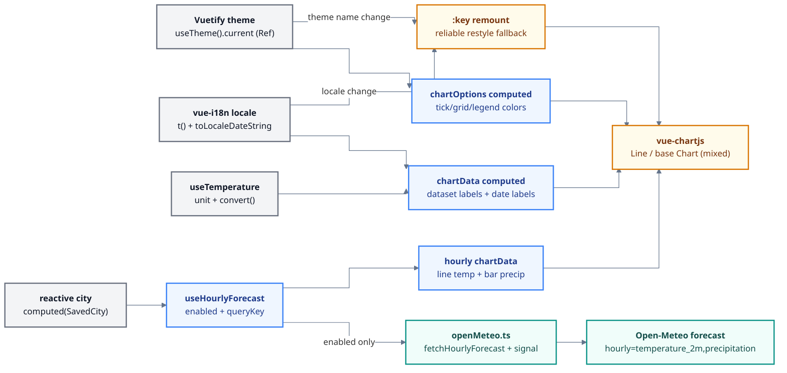

# Phase 6: Localized, Theme-Aware Charts - Research

**Researched:** 2026-07-08
**Domain:** Vue 3 charts (chart.js/vue-chartjs reactivity), Vuetify 4 theme reactivity, vue-i18n runtime locale switching, locale-aware date formatting (Intl), vee-validate + yup message i18n, WMO label i18n
**Confidence:** HIGH (all library shapes verified against installed type declarations; Open-Meteo hourly + a few reactivity fallbacks verified against docs/marked ASSUMED)

## Summary

Phase 6 is a "make the charts honest across theme + locale, and add one new chart" pass. Nothing here needs a new dependency: every capability is already installed. The five requirements split cleanly: (CHRT-03) make the existing `ForecastChart` restyle on light/dark toggle; (CHRT-04) i18n the dataset labels and localize the axis dates; (CHRT-05) add a new hourly mixed chart (temperature line + precipitation bars) on the detail page; (I18N-04) move the `CitySearch` yup validation messages into en/ja; (I18N-05) move the WMO condition labels out of `src/lib/wmo.ts` into en/ja message keys.

The single most important technical fact shaping the plan: the current `ForecastChart` `chartOptions` is a **plain non-reactive object** (`const chartOptions = { responsive, maintainAspectRatio }`), so it has no theme awareness at all and Chart.js will never restyle on a theme flip. The fix is to make `chartOptions` a `computed` that reads Vuetify's active theme via `useTheme().current` (a `Ref` - `theme.current.value.dark` and `theme.current.value.colors`), and to feed `ticks.color` / `grid.color` / `plugins.legend.labels.color` / dataset colors from that. vue-chartjs v5 watches both `:data` and `:options` and calls `chart.update()`, so a `computed` options object generally re-renders in place - but options/scale changes are the documented weak spot of that watcher, so the reliable belt-and-braces move for a study project is to also put a `:key` on the chart component that changes with theme name + locale, forcing a clean remount. Both `theme.current` and the `ThemeInstance` shape are verified against the installed Vuetify 4.1.1 types.

The i18n reactivity story is already established and free: `t()` from `useI18n()` is reactive to the active locale, and the app already binds locale live via `useLanguagePreference()` (Settings switch updates every route with no reload). Because `chartData` is a `computed`, referencing `t()` and a locale-derived date formatter inside it means dataset labels and axis dates re-render on locale switch automatically - the exact same pattern `ForecastList.vue` already uses for its localized dates (`dateLocale = computed(() => locale.value === 'ja' ? 'ja-JP' : 'en-GB')`). Reuse that verbatim.

**Primary recommendation:** Plan three UI streams that share one reactivity discipline - "read theme/locale/unit inside `computed`s that produce the Chart.js `data`/`options`, and force-remount with `:key` when theme or locale changes." Stream 1: retrofit `ForecastChart` for theme + i18n labels + locale dates (CHRT-03/04). Stream 2: add `fetchHourlyForecast` to the API layer + a `useHourlyForecast` reactive composable (mirroring the Phase 5 `useForecast` pattern) + a new `HourlyChart.vue` mixed chart on the detail page (CHRT-05). Stream 3: pure i18n key moves for validation messages (I18N-04) and WMO labels (I18N-05), each needing en/ja parity. No new deps; `@vee-validate/i18n` and `@vee-validate/rules` are NOT installed and must NOT be added - use a reactive computed yup schema instead.

## Project Constraints (from CLAUDE.md)

- Tech stack fixed: Vue 3 + TypeScript + Vite. This is the thing being learned - readability over cleverness.
- Data source: Open-Meteo API only, no API key. Frontend only, no backend.
- **No new dependencies in Phase 6.** The phase must be built entirely with the already-installed stack. Do NOT add `@vee-validate/i18n`, `@vee-validate/rules`, `chartjs-adapter-*`, `date-fns`, or any i18n-message helper. Ask before adding anything.
- Each popular library should have one obvious, visible job. Every file carries teaching comments (existing convention) - keep that voice.
- All edits go through a GSD workflow (this research is part of `/gsd-plan-phase`).
- User global rule: never use the em-dash character in authored content; use "-".

<phase_requirements>
## Phase Requirements

| ID | Description | Research Support |
|----|-------------|------------------|
| CHRT-03 | Forecast chart colors, axis and legend text adapt to the active light/dark theme | Verified `useTheme()` returns `ThemeInstance` with reactive `current: Ref<{dark, colors}>` (installed types); fix = `computed` options reading `theme.current.value` + `:key` remount. Pattern 1, Code Example 1, Pitfall 1-2 |
| CHRT-04 | Chart dataset labels are i18n-keyed and axis dates render in the active locale | `t()` is locale-reactive; `chartData` is already a `computed` so labels re-render; date axis reuses `ForecastList`'s `toLocaleDateString(dateLocale)` pattern. Pattern 2, Code Example 2, Pitfall 3 |
| CHRT-05 | Hourly forecast chart (temperature line + precipitation bars, mixed) on detail page, reacts to city + unit | Open-Meteo forecast supports `hourly=temperature_2m,precipitation`; API layer + composable do NOT request it yet - both need extending. Mixed chart via base `Chart` component `type="bar"` + per-dataset `type:'line'`, two y-axes. Pattern 3-4, Code Example 3-4, Pitfall 4-5 |
| I18N-04 | vee-validate error messages are i18n-keyed (en/ja) | `CitySearch` schema has 3 English yup literals (`Enter a city name`, `Type at least 2 characters`, `City name is too long`). `useField` `rules` param is `MaybeRef` (installed types) so a `computed` yup schema referencing `t()` re-validates on locale change. No new dep. Pattern 5, Code Example 5, Pitfall 6 |
| I18N-05 | WMO weather condition labels are i18n-keyed (en/ja) | 28 codes + fallback in `src/lib/wmo.ts` (English `label`s). Move labels to a `wmo.<code>` message block, keep icons in wmo.ts, translate at render (`t('wmo.'+code)`). Full code list in Pattern 6. Pitfall 7 |
</phase_requirements>

## Architectural Responsibility Map

| Capability | Primary Tier | Secondary Tier | Rationale |
|------------|-------------|----------------|-----------|
| Chart theme styling (CHRT-03) | Browser/Client - `ForecastChart.vue` (+ new `HourlyChart.vue`) | Vuetify `useTheme()` provides the color source | The chart component owns its Chart.js `options`; Vuetify owns the palette. Charts read the palette, they do not set it |
| Chart i18n labels + locale dates (CHRT-04) | Browser/Client - chart components | vue-i18n (`t`, `locale`) | Labels/dates are view-layer text derived reactively from the active locale |
| Hourly data fetch (CHRT-05) | Browser/Client - `src/lib/openMeteo.ts` (HTTP) + `useHourlyForecast` composable (server state) | Open-Meteo forecast host | Same two-tier split Phase 5 established: HTTP layer builds the request, the composable owns caching/reactivity |
| Hourly chart render (CHRT-05) | Browser/Client - new `HourlyChart.vue` | `useTemperature` (unit convert) | Presentation only; unit conversion is delegated to the existing composable |
| Validation message i18n (I18N-04) | Browser/Client - `CitySearch.vue` | vue-i18n + yup | The form owns its schema; messages are localized text |
| WMO label i18n (I18N-05) | Browser/Client - `src/lib/wmo.ts` (icon map) + `WeatherCard`/`ForecastList` (render `t()`) | vue-i18n | Icon mapping is data (stays in the util); the human label is localized text (moves to messages) |

## Standard Stack

No new libraries. Everything below is already installed and verified against `node_modules` type declarations this session.

### Core

| Library | Version (installed) | Purpose in Phase 6 | Why it is the right tool |
|---------|---------------------|--------------------|--------------------------|
| chart.js | 4.5.1 | Chart engine; tree-shaken, explicit registration | Already the chart engine (CHRT-01/02). Mixed charts need controllers registered (Pattern 3) [VERIFIED: node_modules/chart.js 4.5.1] |
| vue-chartjs | 5.3.3 | Vue wrapper; reactive `:data`/`:options`; base `Chart` component for mixed charts | Exposes `Line`, `Bar`, and a base `Chart` (type-prop) component - the base one is how you build a mixed line+bar chart [VERIFIED: node_modules/vue-chartjs/dist/index.d.ts exports `Chart`, `Line`, `Bar`] |
| vuetify | 4.1.1 | Theme source via `useTheme()` | `useTheme()` returns `ThemeInstance` with `current: DeepReadonly<Ref<{dark, colors, variables}>>` and `name: Ref<string>` - the reactive palette for CHRT-03 [VERIFIED: node_modules/vuetify/lib/composables/theme.d.ts lines 54-72, 88] |
| vue-i18n | 11.4.6 | `t()` (locale-reactive labels/messages) + `locale` (drives Intl date formatting) | Already migrated to v11 in Phase 5; `t()` reactivity is what makes labels re-render on locale switch [VERIFIED: installed; Phase 5 research] |
| vee-validate | 4.15.1 | Form validation for `CitySearch`; `useField` `rules` is `MaybeRef` | Reactive computed yup schema re-validates on locale change with no extra package [VERIFIED: node_modules/vee-validate/dist/vee-validate.d.ts line 558] |
| yup | 1.7.1 | Schema + per-rule message strings | Messages are plain strings/args - swap literals for `t()` calls [VERIFIED: installed] |
| @tanstack/vue-query | 5.101.0 | Reactive server state for the new hourly query | Reuse the exact Phase 5 `MaybeRefOrGetter<SavedCity>` + `enabled` guard pattern [VERIFIED: Phase 5 research] |

### Supporting

| Library | Version | Purpose | When to use |
|---------|---------|---------|-------------|
| Intl.DateTimeFormat / `Date.toLocaleDateString` | platform (Node 22 / browser) | Locale-formatted axis dates + hourly time labels | CHRT-04 axis dates; reuse `ForecastList`'s `dateLocale` computed. No library needed |
| @vueuse/core | 14.3.0 | (already used) - not newly needed here | - |

### Alternatives Considered

| Instead of | Could Use | Tradeoff |
|------------|-----------|----------|
| `computed` yup schema referencing `t()` (I18N-04) | `@vee-validate/i18n` `localize()` + locale dictionaries | It is a NEW dependency (not approved) and heavier than three messages need. The computed-schema approach is beginner-obvious and dep-free |
| Base `Chart` component `type="bar"` + per-dataset `type:'line'` (CHRT-05) | Two stacked separate charts | A mixed chart is exactly the "one obvious job" the requirement asks to demonstrate; two charts miss the teaching point of dual axes |
| `Date.toLocaleDateString` for axis dates (CHRT-04) | Chart.js time scale + `chartjs-adapter-date-fns` | The adapter is a NEW dependency and overkill; the labels are already pre-formatted strings passed as category labels, exactly like `ForecastList` |
| `t('wmo.'+code)` at render (I18N-05) | Keep a giant en/ja switch in wmo.ts | Message keys keep locale data in the locale files (parity check is one place) and match how the rest of the app is translated |

**Installation:** none. `npm install` adds nothing this phase.

**Version verification (done this session, read from node_modules/*/package.json):**
```bash
chart.js = 4.5.1   vue-chartjs = 5.3.3   vuetify = 4.1.1
vee-validate = 4.15.1   yup = 1.7.1   vue-i18n = 11.4.6
@tanstack/vue-query = 5.101.0   @vueuse/core = 14.3.0
```

## Package Legitimacy Audit

Not applicable - Phase 6 installs no external packages. All libraries were vetted when first added (Phases 1-5). No `npm install` step, no legitimacy gate needed.

**Packages removed due to [SLOP] verdict:** none (none recommended).
**Packages flagged as suspicious [SUS]:** none.

## Architecture Patterns

### System Architecture Diagram

Note: the init block below renders correctly on GitHub; the local VS Code mermaid preview extension shows a blank box on any init directive (known limitation) - preview locally without the first line if needed.



The three reactive sources (theme, locale, unit) all feed `computed`s that produce Chart.js `data`/`options`; vue-chartjs re-renders on those prop changes, and a `:key` bound to theme-name + locale guarantees a full remount when the in-place update is not enough.

### Recommended Project Structure (additions/edits only)

```
src/
├── lib/
│   └── openMeteo.ts             # CHRT-05: add fetchHourlyForecast() (edit)
├── composables/
│   └── useHourlyForecast.ts     # CHRT-05: new reactive composable (mirror useForecast)
├── components/
│   ├── ForecastChart.vue        # CHRT-03/04: theme options + i18n labels + locale dates (edit)
│   └── HourlyChart.vue          # CHRT-05: new mixed line+bar chart (new)
├── lib/
│   └── wmo.ts                   # I18N-05: return labelKey/icon, drop English labels (edit)
├── components/
│   ├── WeatherCard.vue          # I18N-05: render t(labelKey) (edit)
│   └── CitySearch.vue           # I18N-04: computed yup schema with t() (edit)
├── pages/
│   └── CityDetailPage.vue       # CHRT-05: mount HourlyChart under the temperature chart (edit)
├── types/
│   └── weather.ts               # CHRT-05: add HourlyForecast type (edit)
└── i18n/messages/
    ├── en.ts                    # add chart.*, validation.*, wmo.* blocks (edit)
    └── ja.ts                    # same keys, Japanese values (edit)
```

### Pattern 1: Theme-reactive Chart.js options (CHRT-03)

**What:** Read Vuetify's active theme inside a `computed` options object; feed colors to ticks, grid, legend labels, and dataset strokes.
**When to use:** every chart component (ForecastChart + HourlyChart).
`useTheme()` returns a `ThemeInstance` whose `current` is a `Ref` - `theme.current.value.dark` (boolean) and `theme.current.value.colors` (has `background`, `surface`, `primary`, `on-surface`, etc.) [VERIFIED: node_modules/vuetify/lib/composables/theme.d.ts lines 34-72]. Derive a text color and a grid color from `dark`, and pull dataset/accent colors from `colors`.

**Reactivity contract:** because `options` is a `computed` reading `theme.current.value`, a theme flip produces a new options object; vue-chartjs watches `:options` and updates. Bind `:key="theme.name.value + '-' + locale"` on the chart as the reliable remount fallback (Pitfall 1).

### Pattern 2: Locale-reactive labels + axis dates (CHRT-04)

**What:** dataset `label`s come from `t('chart.tempHigh', { unit })`; axis date labels come from `toLocaleDateString(dateLocale)`.
**When to use:** ForecastChart (and HourlyChart for time labels).
`chartData` is already a `computed`; add `const { t, locale } = useI18n()` and reference both inside it. Reuse `ForecastList.vue`'s proven line: `const dateLocale = computed(() => (locale.value === 'ja' ? 'ja-JP' : 'en-GB'))`, then map `props.forecast.dates` through `new Date(iso).toLocaleDateString(dateLocale.value, {weekday:'short', day:'numeric', month:'short'})` to produce the `labels` array [VERIFIED: existing src/components/ForecastList.vue lines 15-28].

### Pattern 3: Mixed line+bar chart via the base `Chart` component (CHRT-05)

**What:** one chart, `type="bar"`, with a temperature dataset overridden to `type: 'line'` on a left y-axis and a precipitation `bar` dataset on a right y-axis.
**When to use:** HourlyChart.vue only.
The base `Chart` component (exported by vue-chartjs) takes a required `type` prop [VERIFIED: node_modules/vue-chartjs/dist/props.d.ts line 60-63]. For a mixed chart you must register BOTH controllers plus the elements/scales:
```
ChartJS.register(
  BarController, BarElement,
  LineController, LineElement, PointElement,
  LinearScale, CategoryScale, Tooltip, Legend,
)
```
Two y-axes: `scales: { y: { position: 'left' }, y1: { position: 'right', grid: { drawOnChartArea: false } } }`; the temperature dataset uses `yAxisID: 'y'`, precipitation uses `yAxisID: 'y1'`.

### Pattern 4: Reactive hourly composable (CHRT-05)

**What:** `useHourlyForecast(city: MaybeRefOrGetter<SavedCity | undefined>)` - a copy of `useForecast` with a different `queryKey`, `queryFn` (calls `fetchHourlyForecast`), same `enabled` guard.
**When to use:** the detail page passes its existing `city` computed straight in (`useHourlyForecast(city)`), so the hourly chart reacts to city change exactly like the daily one does [VERIFIED: existing src/composables/useForecast.ts + Phase 5 research Pattern 1]. Unit reactivity is handled inside HourlyChart via `useTemperature().convert`, identical to ForecastChart.

### Pattern 5: i18n-keyed validation via reactive computed schema (I18N-04)

**What:** build the yup schema inside a `computed` that reads `t()`, and pass it as the reactive `rules` argument to `useField`.
**When to use:** CitySearch.vue.
`useField(path, rules?: MaybeRef<RuleExpression>, opts?)` - `rules` is `MaybeRef`, so a `computed` schema is accepted and vee-validate re-validates when it changes [VERIFIED: node_modules/vee-validate/dist/vee-validate.d.ts line 558]. Keep `validateOnValueUpdate: false` (existing anti-stale-error behavior). See Pitfall 6 for the "already-displayed error re-translates on locale switch" nuance.

### Pattern 6: WMO labels as message keys (I18N-05)

**What:** `wmo.ts` keeps the icon map and returns `{ labelKey, icon }` (or just the code); components render `t(labelKey)`. Add a `wmo` block to en/ja keyed by code.
**The exact code set present today (28 codes + fallback):** `0, 1, 2, 3, 45, 48, 51, 53, 55, 56, 57, 61, 63, 65, 66, 67, 71, 73, 75, 77, 80, 81, 82, 85, 86, 95, 96, 99`, plus `unknown` for the fallback [VERIFIED: src/lib/wmo.ts WMO_TABLE + FALLBACK]. So each locale gains a `wmo` object with 28 numeric-string keys plus `unknown` = 29 keys. `t('wmo.0')` works (vue-i18n accepts numeric-string leaf keys). Render sites to update: `WeatherCard.vue` (`condition.label` -> `t(condition.labelKey)`) and `ForecastList.vue` (`day.condition.label` -> `t(...)`).

### Anti-Patterns to Avoid

- **Plain (non-reactive) chart options** - the current `const chartOptions = {...}`. It cannot restyle on theme change. Options MUST be a `computed` reading the theme (CHRT-03's whole point).
- **Hard-coded dataset colors that ignore theme** - `borderColor: '#e53935'` is fine as a fixed brand hue for the temp lines, but tick/grid/legend text MUST come from the theme or they vanish on dark background. Keep semantic data colors static, make chrome colors theme-driven.
- **Adding a date/time adapter or a validation-i18n package** - both are NEW dependencies and unnecessary. Use `toLocaleDateString` and a computed yup schema.
- **A giant en/ja switch inside wmo.ts** - keep locale text in the locale files.
- **Requesting 168 hourly points and plotting all of them** - unreadable. Scope the hourly window (Pitfall 5).
- **Passing `props.city` by value to the new composable** - snapshots the prop; pass the reactive `city` computed (Phase 5 Pitfall 2).

## Don't Hand-Roll

| Problem | Don't Build | Use Instead | Why |
|---------|-------------|-------------|-----|
| Theme color source for charts | Manual `matchMedia('prefers-color-scheme')` / hard-coded palettes | Vuetify `useTheme().current` | Single source of truth already driving the whole UI; reactive Ref [VERIFIED: installed types] |
| Chart re-render on data change | `chartRef.update()` imperative calls | vue-chartjs reactive `:data`/`:options` (+ `:key` remount) | The wrapper already watches props; imperative update is the thing the wrapper exists to avoid |
| Locale date formatting | Hand-rolled month/weekday tables | `Date.toLocaleDateString(bcp47, opts)` | Built-in, locale-correct, already used in ForecastList |
| Localized validation messages | String maps + manual locale lookup in the component | Computed yup schema reading `t()` (`rules` is MaybeRef) | vee-validate re-validates on rules change; dep-free [VERIFIED: installed types] |
| WMO label translation | switch/case per language in JS | vue-i18n `wmo.<code>` message keys | Parity-checkable in one place; matches app-wide i18n |

**Key insight:** like Phase 5, every requirement maps to a first-class feature of an already-installed library. The work is wiring reactive sources (theme/locale/unit/city) into `computed`s - not writing new machinery.

## Runtime State Inventory

Phase 6 adds features and moves strings into message files; it is NOT a rename/migration phase and touches no stored keys, service config, OS state, secrets, or build-name artifacts. Audited all five categories:

| Category | Items Found | Action Required |
|----------|-------------|------------------|
| Stored data | `localStorage` key `weather-prefs` (unit/theme/language) is READ by the chart/i18n reactivity but its shape and key are unchanged | None - verified by reading src/stores/preferences.ts; no schema/key change in scope |
| Live service config | None - Open-Meteo is anonymous/stateless; the only new call is a new query-param set (`hourly=...`) to the same public host | None |
| OS-registered state | None | None |
| Secrets/env vars | None - no API key by design | None |
| Build artifacts | `dist/` becomes stale after component/API edits; new `HourlyChart.vue` + `useHourlyForecast.ts` add chunks to the CityDetailPage lazy route | `npm run build` regenerates; no manual action |

## Common Pitfalls

### Pitfall 1: Chart does not restyle on theme toggle (the classic trap)
**What goes wrong:** you make `chartOptions` a `computed` reading the theme, but the chart's axes/legend keep the old colors after a light/dark flip.
**Why it happens:** vue-chartjs v5 watches `:options`, but Chart.js updates some scale/plugin styling only on a full re-init, not on a shallow options swap; the in-place `chart.update()` can miss tick/grid/legend color changes.
**How to avoid:** primary fix is the `computed` options (do it). Reliable belt-and-braces: bind `:key="theme.name.value + '-' + locale"` on the `<Line>`/`<Chart>` element so a theme or locale change remounts the chart cleanly. For a study project the `:key` remount is the readable, always-correct choice; document why in a teaching comment. [ASSUMED: exact scope of vue-chartjs 5.3.3 options-watch coverage - the `:key` remount is the safe superset; verify visually at execution]
**Warning signs:** dataset colors update but axis text stays dark-on-dark (invisible) after toggling to dark theme.

### Pitfall 2: Reading `theme.current` without `.value`
**What goes wrong:** `theme.current.colors.primary` is `undefined`; TypeScript may not catch it through the DeepReadonly wrapper.
**Why it happens:** `useTheme().current` is a `Ref` (`DeepReadonly<Ref<InternalThemeDefinition>>`), so the palette is at `theme.current.value.colors` [VERIFIED: theme.d.ts line 63].
**How to avoid:** always `theme.current.value.dark` / `theme.current.value.colors['on-surface']`. Inside a `computed` the `.value` read also registers the dependency so the computed re-runs on theme change.
**Warning signs:** colors are `undefined`; chart chrome renders with Chart.js defaults regardless of theme.

### Pitfall 3: Axis dates or dataset labels do not re-translate on language switch
**What goes wrong:** switching en/ja updates page chrome but the chart keeps English labels/dates.
**Why it happens:** the label/date strings were computed once (or `t()`/`locale` was read outside a reactive `computed`), so no dependency was tracked.
**How to avoid:** read `t()` and `locale.value` INSIDE the `chartData` computed. vue-i18n's `t` is locale-reactive and the app already switches locale live via `useLanguagePreference()`. This mirrors `ForecastList` exactly.
**Warning signs:** ForecastList dates localize but the chart's do not - a tell that the chart is reading locale non-reactively.

### Pitfall 4: Mixed chart renders nothing / throws "not a registered controller"
**What goes wrong:** the hourly chart is blank or Chart.js throws about `bar`/`line` controller.
**Why it happens:** tree-shaken Chart.js requires explicit controller registration; the base `Chart` component does not auto-register like the typed `Bar`/`Line` wrappers do.
**How to avoid:** register `BarController, BarElement, LineController, LineElement, PointElement, LinearScale, CategoryScale, Tooltip, Legend` once at module load in HourlyChart.vue (Pattern 3).
**Warning signs:** console error `"bar" is not a registered controller` or an empty canvas.

### Pitfall 5: Hourly chart is an unreadable wall of 168 points
**What goes wrong:** Open-Meteo `hourly` with the default `forecast_days=7` returns 168 timestamps; plotting all of them is illegible.
**Why it happens:** the hourly arrays cover the full forecast window.
**How to avoid:** scope the window - request `forecast_days=1` (24 points) for the hourly call, OR pass Open-Meteo's `forecast_hours=24`, OR slice the returned arrays to the next ~24 entries. Recommend `forecast_days=2` requested and slice to the next 24 from "now" so the chart starts at the current hour. Keep it simple and document the choice. [ASSUMED: `forecast_hours` param name - `forecast_days=1` + slice is the safe, well-known path; confirm against Open-Meteo docs at execution]
**Warning signs:** x-axis labels overlap into an unreadable smear.

### Pitfall 6: A validation error already on screen does not re-translate on locale switch
**What goes wrong:** the user triggers "Type at least 2 characters", switches to Japanese, and the message stays English until they type again.
**Why it happens:** `validateOnValueUpdate: false` means the field only re-validates on explicit `validate()` or value change; a computed-schema swap re-validates when vee-validate watches `rules`, but timing can differ.
**How to avoid:** passing the schema as a `computed` (reactive `rules`) makes vee-validate re-validate when the schema identity changes on locale switch - verify this re-translates the visible error. If it does not, add a tiny `watch(locale, () => { if (errorMessage.value) validate() })` in CitySearch. Keep `validateOnValueUpdate: false` regardless (it prevents the stale "required" bug the code comments call out). [ASSUMED: vee-validate 4.15.1 re-validates a touched field on `rules` computed change - MEDIUM confidence; the `watch(locale)` fallback is deterministic]
**Warning signs:** page chrome switches language but a live form error lags one interaction behind.

### Pitfall 7: en/ja key parity break when adding the new blocks
**What goes wrong:** you add `chart.*`, `validation.*`, and `wmo.*` to `en.ts` but miss a key (or a WMO code) in `ja.ts`, so a switch to Japanese silently falls back to English for that string.
**Why it happens:** three new blocks across two files; `wmo` alone is 29 keys each.
**How to avoid:** add the blocks to BOTH files in the same task; the WMO code list is fixed (Pattern 6) - copy it. The existing en.ts header comment documents the parity rule; keep it. A quick guard: the app's `fallbackLocale: 'en'` hides missing ja keys at runtime, so eyeball parity (or add a tiny key-count assertion in a test) rather than trusting the running app.
**Warning signs:** a Japanese condition label or chart legend shows English; no console error (fallback masks it).

### Pitfall 8: Precipitation dataset scaled against the temperature axis
**What goes wrong:** precipitation bars (0-10 mm) are invisible next to a 0-40 degree temperature line because they share one y-axis.
**Why it happens:** both datasets default to axis `y`.
**How to avoid:** give precipitation its own right-hand axis (`yAxisID: 'y1'`) with `grid.drawOnChartArea: false` so the two scales do not fight (Pattern 3). Do NOT unit-convert precipitation (it is mm; only temperature has a unit toggle this milestone - wind unit is Phase 7).
**Warning signs:** flat/near-zero bars regardless of actual precipitation.

## Code Examples

### 1. Theme-reactive ForecastChart options (CHRT-03)

```typescript
// src/components/ForecastChart.vue <script setup>
// Source: installed vuetify 4.1.1 theme types (useTheme(): ThemeInstance,
// current: Ref<{dark, colors}>) + chart.js 4 options shape.
import { computed } from 'vue'
import { useTheme } from 'vuetify'
import { useI18n } from 'vue-i18n'

const theme = useTheme()
const { t, locale } = useI18n()

// Chrome colors follow the active theme; data hues (red/blue) stay fixed brand colors.
const chartOptions = computed(() => {
  const dark = theme.current.value.dark
  const text = dark ? '#e0e0e0' : '#333333'          // legible on the active surface
  const grid = dark ? 'rgba(255,255,255,0.12)' : 'rgba(0,0,0,0.08)'
  return {
    responsive: true,
    maintainAspectRatio: false,
    plugins: { legend: { labels: { color: text } } },
    scales: {
      x: { ticks: { color: text }, grid: { color: grid } },
      y: { ticks: { color: text }, grid: { color: grid } },
    },
  }
})
```

```vue
<template>
  <div data-testid="forecast-chart" style="height: 320px">
    <!-- :key remount = reliable restyle on theme/locale change (Pitfall 1). -->
    <Line :key="theme.name.value + '-' + locale" :data="chartData" :options="chartOptions" />
  </div>
</template>
```

### 2. i18n dataset labels + locale axis dates (CHRT-04)

```typescript
// ForecastChart.vue - chartData computed now reads t(), unit, AND locale.
// dateLocale copied verbatim from ForecastList.vue (existing, proven).
const dateLocale = computed(() => (locale.value === 'ja' ? 'ja-JP' : 'en-GB'))

const chartData = computed(() => ({
  labels: props.forecast.dates.map((iso) =>
    new Date(iso).toLocaleDateString(dateLocale.value, {
      weekday: 'short', day: 'numeric', month: 'short',
    }),
  ),
  datasets: [
    {
      label: t('chart.tempHigh', { unit: unitSymbol.value }),   // was `High ${unit}`
      data: props.forecast.tempMax.map((c) => convert(c)),
      borderColor: '#e53935', backgroundColor: '#e53935', tension: 0.3,
    },
    {
      label: t('chart.tempLow', { unit: unitSymbol.value }),
      data: props.forecast.tempMin.map((c) => convert(c)),
      borderColor: '#1e88e5', backgroundColor: '#1e88e5', tension: 0.3,
    },
  ],
}))
```

New en keys: `chart: { tempHigh: 'High {unit}', tempLow: 'Low {unit}' }`; ja: `chart: { tempHigh: '最高 {unit}', tempLow: '最低 {unit}' }` (final wording is the planner/translator's call - keys must match).

### 3. Hourly API layer + type (CHRT-05)

```typescript
// src/types/weather.ts - new type (parallel arrays, same convention as DailyForecast)
export interface HourlyForecast {
  times: string[]         // ISO datetime per hour
  temperature: number[]   // °C
  precipitation: number[] // mm
}

// src/lib/openMeteo.ts - new function; same shared http client + FORECAST_URL.
interface HourlyForecastResponse {
  hourly: { time: string[]; temperature_2m: number[]; precipitation: number[] }
}
export async function fetchHourlyForecast(
  latitude: number, longitude: number, signal?: AbortSignal,
): Promise<HourlyForecast> {
  const response = await http.get<HourlyForecastResponse>(FORECAST_URL, {
    params: {
      latitude, longitude,
      hourly: 'temperature_2m,precipitation',
      forecast_days: 1,        // one day = 24 points (keeps the chart readable, Pitfall 5)
      timezone: 'auto',
    },
    signal,
  })
  const { hourly } = response.data
  return { times: hourly.time, temperature: hourly.temperature_2m, precipitation: hourly.precipitation }
}
```

### 4. useHourlyForecast composable (CHRT-05)

```typescript
// src/composables/useHourlyForecast.ts - a direct sibling of useForecast.ts (Phase 5 pattern).
import { computed, toValue, type MaybeRefOrGetter } from 'vue'
import { useQuery } from '@tanstack/vue-query'
import { fetchHourlyForecast } from '@/lib/openMeteo'
import type { SavedCity } from '@/types/weather'

export function useHourlyForecast(city: MaybeRefOrGetter<SavedCity | undefined>) {
  return useQuery({
    queryKey: computed(() => ['hourly', toValue(city)?.key]),
    queryFn: ({ signal }) => {
      const c = toValue(city)
      if (!c) throw new Error('useHourlyForecast: query must stay disabled without a city')
      return fetchHourlyForecast(c.latitude, c.longitude, signal)
    },
    enabled: computed(() => !!toValue(city)),
    staleTime: 5 * 60 * 1000,
  })
}
```

CityDetailPage passes its existing `city` computed: `const { data: hourly } = useHourlyForecast(city)`, then renders `<HourlyChart v-if="hourly" :hourly="hourly" />` under the temperature chart.

### 5. Mixed hourly chart component (CHRT-05)

```typescript
// src/components/HourlyChart.vue <script setup> - base Chart component, mixed line+bar.
import { computed } from 'vue'
import {
  Chart as ChartJS,
  BarController, BarElement, LineController, LineElement, PointElement,
  LinearScale, CategoryScale, Tooltip, Legend,
} from 'chart.js'
import { Chart } from 'vue-chartjs'        // base component (takes a `type` prop)
import { useTheme } from 'vuetify'
import { useI18n } from 'vue-i18n'
import { useTemperature } from '@/composables/useTemperature'
import type { HourlyForecast } from '@/types/weather'

// Mixed chart needs BOTH controllers registered (Pitfall 4).
ChartJS.register(
  BarController, BarElement, LineController, LineElement, PointElement,
  LinearScale, CategoryScale, Tooltip, Legend,
)

const props = defineProps<{ hourly: HourlyForecast }>()
const theme = useTheme()
const { t, locale } = useI18n()
const { convert, unitSymbol } = useTemperature()

const timeLocale = computed(() => (locale.value === 'ja' ? 'ja-JP' : 'en-GB'))

const chartData = computed(() => ({
  labels: props.hourly.times.map((iso) =>
    new Date(iso).toLocaleTimeString(timeLocale.value, { hour: '2-digit' }),
  ),
  datasets: [
    {
      type: 'line' as const,
      label: t('chart.temperature', { unit: unitSymbol.value }),
      data: props.hourly.temperature.map((c) => convert(c)),
      borderColor: '#e53935', backgroundColor: '#e53935',
      yAxisID: 'y', tension: 0.3,
    },
    {
      type: 'bar' as const,
      label: t('chart.precipitation'),
      data: props.hourly.precipitation,
      backgroundColor: '#1e88e5',
      yAxisID: 'y1',
    },
  ],
}))

const chartOptions = computed(() => {
  const dark = theme.current.value.dark
  const text = dark ? '#e0e0e0' : '#333333'
  const grid = dark ? 'rgba(255,255,255,0.12)' : 'rgba(0,0,0,0.08)'
  return {
    responsive: true, maintainAspectRatio: false,
    plugins: { legend: { labels: { color: text } } },
    scales: {
      x: { ticks: { color: text }, grid: { color: grid } },
      y:  { position: 'left'  as const, ticks: { color: text }, grid: { color: grid } },
      y1: { position: 'right' as const, ticks: { color: text }, grid: { drawOnChartArea: false } },
    },
  }
})
```

```vue
<template>
  <div data-testid="hourly-chart" style="height: 320px">
    <Chart
      type="bar"
      :key="theme.name.value + '-' + locale"
      :data="chartData"
      :options="chartOptions"
    />
  </div>
</template>
```

### 6. i18n-keyed validation schema (I18N-04)

```typescript
// src/components/CitySearch.vue <script setup>
// rules is MaybeRef, so a computed schema is accepted and re-validates on locale change.
import { computed } from 'vue'
const { t } = useI18n()

const schema = computed(() =>
  yup.string()
    .required(t('validation.cityRequired'))     // was 'Enter a city name'
    .min(2, t('validation.cityMin'))            // was 'Type at least 2 characters'
    .max(80, t('validation.cityMax')),          // was 'City name is too long'
)

const { value: term, errorMessage, validate, resetField } = useField<string>('city', schema, {
  validateOnValueUpdate: false,   // keep: prevents the stale "required" error after select
})

// If a visible error does not re-translate on locale switch, add:
// watch(locale, () => { if (errorMessage.value) validate() })
```

New en keys: `validation: { cityRequired: 'Enter a city name', cityMin: 'Type at least 2 characters', cityMax: 'City name is too long' }`; ja: natural Japanese equivalents.

### 7. WMO labels as keys (I18N-05)

```typescript
// src/lib/wmo.ts - keep the icon map, return a labelKey instead of an English label.
interface Condition { labelKey: string; icon: string }
const WMO_TABLE: Record<number, Condition> = {
  0:  { labelKey: 'wmo.0',  icon: 'mdi-weather-sunny' },
  // ... same 28 codes, labelKey: `wmo.${code}` ...
  99: { labelKey: 'wmo.99', icon: 'mdi-weather-lightning-rainy' },
}
const FALLBACK: Condition = { labelKey: 'wmo.unknown', icon: 'mdi-weather-cloudy-alert' }
export function wmoToCondition(code: number): Condition {
  return WMO_TABLE[code] ?? FALLBACK
}
```

```vue
<!-- WeatherCard.vue + ForecastList.vue render sites -->
<div class="text-body-2">{{ t(condition.labelKey) }}</div>
<v-list-item-subtitle>{{ t(day.condition.labelKey) }}</v-list-item-subtitle>
```

en `wmo` block keys: `0,1,2,3,45,48,51,53,55,56,57,61,63,65,66,67,71,73,75,77,80,81,82,85,86,95,96,99, unknown` with the current English strings from wmo.ts as values; ja gets the same keys with Japanese values.

## Files to Modify

| File | Requirement(s) | Change |
|------|----------------|--------|
| `src/components/ForecastChart.vue` | CHRT-03, CHRT-04 | `chartOptions` -> `computed` reading `useTheme().current`; `chartData` labels via `t()` + `toLocaleDateString`; `:key` remount on theme/locale |
| `src/lib/openMeteo.ts` | CHRT-05 | add `fetchHourlyForecast()` + `HourlyForecastResponse` interface |
| `src/types/weather.ts` | CHRT-05 | add `HourlyForecast` interface |
| `src/composables/useHourlyForecast.ts` | CHRT-05 | NEW - mirror `useForecast` (reactive city + enabled guard) |
| `src/components/HourlyChart.vue` | CHRT-05 | NEW - base `Chart` mixed line+bar, two y-axes, theme + i18n + unit reactive |
| `src/pages/CityDetailPage.vue` | CHRT-05 | mount `HourlyChart` under the temperature chart, fed by `useHourlyForecast(city)` |
| `src/components/CitySearch.vue` | I18N-04 | schema -> `computed` referencing `t()`; optional `watch(locale)` re-validate |
| `src/lib/wmo.ts` | I18N-05 | return `{ labelKey, icon }`; drop English `label` strings |
| `src/components/WeatherCard.vue` | I18N-05 | render `t(condition.labelKey)` |
| `src/components/ForecastList.vue` | I18N-05 | render `t(day.condition.labelKey)` |
| `src/i18n/messages/en.ts` | CHRT-04, I18N-04, I18N-05 | add `chart.*`, `validation.*`, `wmo.*` blocks |
| `src/i18n/messages/ja.ts` | CHRT-04, I18N-04, I18N-05 | same keys, Japanese values (parity) |
| Tests (`src/__tests__/`) | all | update any test asserting the old English WMO labels / old chart label strings; consider a new hourly test if plan calls for it |

## State of the Art

| Old Approach | Current Approach | When Changed | Impact |
|--------------|------------------|--------------|--------|
| Plain static chart options | `computed` options from Vuetify `useTheme().current` | this phase | Enables CHRT-03; theme-reactive charts |
| Dataset labels as template literals (`High ${unit}`) | `t('chart.tempHigh', { unit })` | this phase | Enables CHRT-04; labels localize live |
| Raw ISO date category labels | `toLocaleDateString(bcp47)` labels (already in ForecastList) | this phase for charts | Locale-correct axis dates |
| Daily-only forecast | + hourly `temperature_2m,precipitation` request | this phase | CHRT-05 new mixed chart; API layer + composable extended |
| English-only WMO labels in wmo.ts | `wmo.<code>` message keys (en/ja) | this phase | I18N-05; closes the last English-only strings |
| English yup literals in CitySearch | computed schema with `t()` | this phase | I18N-04 |

**Deprecated/outdated:**
- Chart.js v3 registration names are unchanged in v4 for the elements used here; no migration needed.
- vue-chartjs typed wrappers (`Line`/`Bar`) auto-register only their own controller - do NOT rely on them for a mixed chart; use the base `Chart` and register explicitly.

## Assumptions Log

| # | Claim | Section | Risk if Wrong |
|---|-------|---------|---------------|
| A1 | vue-chartjs 5.3.3's `:options` watch may not fully restyle Chart.js scales/legend on a theme flip, so a `:key` remount is the reliable fix | Pitfall 1, Code Ex 1/5 | Low - the `:key` remount is a strict superset that always works; if the options-watch already suffices, the key just makes it explicit |
| A2 | Open-Meteo `forecast_days=1` on the `hourly` request returns ~24 points; `forecast_hours` is the alternative param | Pitfall 5, Code Ex 3 | Low - `forecast_days` is confirmed used already for daily; slicing the returned array is a deterministic fallback regardless of param name |
| A3 | vee-validate 4.15.1 re-validates a touched field when the `rules` computed identity changes on locale switch | Pitfall 6, Code Ex 6 | Medium - if it lags, the `watch(locale, () => validate())` fallback is deterministic and beginner-clear |
| A4 | vue-i18n accepts numeric-string leaf keys (`t('wmo.0')`) | Pattern 6, Code Ex 7 | Low - standard vue-i18n behavior; if a numeric key is awkward, prefix (`wmo.code0`) is a trivial alternative |
| A5 | Precipitation has no unit toggle this milestone (only temperature) | Pitfall 8 | Low - wind unit is explicitly Phase 7 (WTHR-05); precipitation stays mm |

## Open Questions

1. **Should the hourly chart window start at "now" or at local midnight?**
   - What we know: `forecast_days=1` returns the calendar day's 24 hours from local midnight (timezone=auto). Starting at "now" needs a slice on the returned arrays.
   - What's unclear: which reads better for the study demo.
   - Recommendation: ship `forecast_days=1` (whole local day, no slicing) first for simplicity; a "from now" slice is a trivial follow-up if desired. Planner's call.

2. **Do the fixed data hues (`#e53935` red / `#1e88e5` blue) need dark-theme variants?**
   - What we know: they are chosen to read on both light and dark surfaces and are the existing v1.0 colors.
   - What's unclear: whether contrast on the dark surface is acceptable to the user.
   - Recommendation: keep the existing hues (they already shipped); only the chrome (ticks/grid/legend) must be theme-driven. Revisit only if a visual check shows poor contrast.

3. **Add a key-parity test for the message files?**
   - What we know: `wmo` adds 29 keys per locale; parity errors are masked at runtime by `fallbackLocale: 'en'`.
   - Recommendation: a tiny test asserting `Object.keys(en.wmo).length === Object.keys(ja.wmo).length` (and same for new blocks) is cheap insurance and fits the project's testing habit. Planner decides if it is in scope.

## Environment Availability

| Dependency | Required By | Available | Version | Fallback |
|------------|------------|-----------|---------|----------|
| Node.js >= 22 | existing toolchain / vue-i18n@11 | Yes | v22.14.0 (per Phase 5) | - |
| Installed chart/theme/i18n/validation libs | all requirements | Yes | see Standard Stack | - |
| Open-Meteo forecast host (`hourly` params) | CHRT-05 | Assumed reachable (app works in v1.0) | - | Tests mock via MSW; dev needs network |
| `Intl.DateTimeFormat` (ja-JP/en-GB) | CHRT-04 | Yes | platform ICU (Node 22 full ICU) | - |

**Missing dependencies with no fallback:** none.
**Missing dependencies with fallback:** none. No `npm install` this phase.

## Security Domain

Frontend-only, no auth/secrets; ASVS Level 1 (config `security_asvs_level: 1`, `security_enforcement: true`).

### Applicable ASVS Categories

| ASVS Category | Applies | Standard Control |
|---------------|---------|------------------|
| V2 Authentication | no | No auth by design |
| V3 Session Management | no | No sessions |
| V4 Access Control | no | Single local user |
| V5 Input Validation | yes | yup schema on search input stays (only its messages move to i18n); new hourly request builds params via axios `params` (URL-encoded), never string-concatenated - preserve this |
| V6 Cryptography | no | Nothing to encrypt |
| V14 Config / dependency hygiene | yes | No new dependency added this phase - smallest possible supply-chain surface |

### Known Threat Patterns for this stack

| Pattern | STRIDE | Standard Mitigation |
|---------|--------|---------------------|
| XSS via translated chart labels / WMO messages | Tampering | Messages are static author-controlled TS objects; vue-i18n interpolates params as text; Chart.js renders labels to canvas (not DOM). No `v-html`. Safe |
| XSS via city name in tooltips/labels | Tampering | City names render as Chart.js canvas text / escaped template interpolation; never `v-html` |
| Untrusted route `:id` feeding the new hourly query | Tampering | `:id` is only used to LOOK UP a saved city (existing property); the hourly fetch uses the saved city's lat/lon, not the raw param - preserve this through the CHRT-05 wiring |
| Malformed Open-Meteo hourly response | DoS/robustness | Locally-typed `HourlyForecastResponse` (no `any`); missing arrays surface as an empty/failed chart, not a crash. Consider optional-chaining/guarding if the shape is absent |

## Sources

### Primary (HIGH confidence - verified against installed code this session)
- `node_modules/vuetify/lib/composables/theme.d.ts` (4.1.1) - `useTheme(): ThemeInstance`; `current: DeepReadonly<Ref<{dark, colors, variables}>>`, `name: Ref<string>`, `global.current` (lines 54-72, 88)
- `node_modules/vue-chartjs/dist/index.d.ts` + `props.d.ts` (5.3.3) - exports `Chart`, `Line`, `Bar`; base `Chart` requires a `type` prop (props.d.ts lines 60-63); `data`/`options`/`updateMode` props
- `node_modules/vee-validate/dist/vee-validate.d.ts` (4.15.1) - `useField(path, rules?: MaybeRef<RuleExpression>, opts?)` (line 558) - reactive rules accepted
- `node_modules/*/package.json` - exact versions (chart.js 4.5.1, vue-chartjs 5.3.3, vuetify 4.1.1, vee-validate 4.15.1, yup 1.7.1, vue-i18n 11.4.6, @tanstack/vue-query 5.101.0, @vueuse/core 14.3.0)
- Codebase reads: `ForecastChart.vue`, `ForecastList.vue` (proven `dateLocale`/`toLocaleDateString` pattern), `wmo.ts` (28-code table), `CitySearch.vue` (3 yup literals), `openMeteo.ts` (no hourly today), `useForecast.ts`/`useCurrentWeather.ts` (reactive composable pattern), `useThemePreference.ts`/`useLanguagePreference.ts`/`AppShell.vue` (live theme/locale switch), `preferences.ts` (unit source)

### Secondary (MEDIUM confidence - established patterns / prior phase)
- `.planning/phases/05-refactor-hardening/05-RESEARCH.md` - reactive `MaybeRefOrGetter` + `enabled` composable pattern reused for `useHourlyForecast`
- Chart.js v4 mixed-chart convention (controllers registered, per-dataset `type`, dual `yAxisID`) - standard Chart.js usage

### Tertiary (LOW confidence - marked ASSUMED, verify at execution)
- vue-chartjs 5.3.3 exact options-watch restyle coverage (A1) - mitigated by `:key` remount
- Open-Meteo `forecast_days=1` hourly point count / `forecast_hours` param (A2) - mitigated by array slice
- vee-validate re-validate-on-computed-rules-change timing (A3) - mitigated by `watch(locale)` fallback

## Metadata

**Confidence breakdown:**
- Standard stack: HIGH - every library shape verified against installed type declarations; no new deps to vet
- Theme reactivity (CHRT-03): HIGH on the API (`useTheme().current`); MEDIUM on whether options-watch alone restyles - hence the `:key` remount recommendation (A1)
- i18n labels/dates (CHRT-04): HIGH - reuses an existing, working pattern in the codebase
- Hourly chart (CHRT-05): HIGH on the composable/API pattern and mixed-chart registration; MEDIUM on the exact hourly windowing param (A2)
- Validation i18n (I18N-04): HIGH that reactive rules are accepted; MEDIUM on live re-translate timing (A3, fallback provided)
- WMO i18n (I18N-05): HIGH - straightforward key move; full code list enumerated

**Research date:** 2026-07-08
**Valid until:** ~2026-08-07 (stable; installed versions pinned - re-verify only if the lockfile changes)

## RESEARCH COMPLETE
