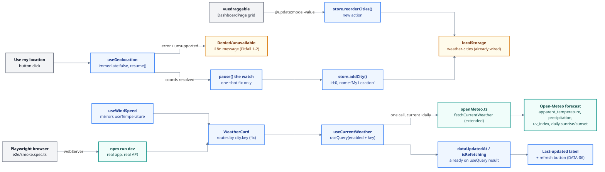

# Phase 7: Richer Weather & Milestone Verification - Research

**Researched:** 2026-07-09
**Domain:** VueUse Geolocation API, vuedraggable (SortableJS) Vue 3 drag-and-drop, Open-Meteo current/daily forecast fields, unit-preference composables, TanStack Vue Query metadata (`dataUpdatedAt`/`isRefetching`), Playwright + Vite e2e setup
**Confidence:** HIGH for the already-installed-library findings (verified against installed type declarations and a live Open-Meteo API call); MEDIUM for the two new dependencies' integration details (official package docs, no installed source yet); LOW/flagged for one significant scope gap (see Summary)

## Summary

Phase 7 is the milestone-closing feature phase: geolocation ("use my location"), drag-and-drop city reorder, richer current conditions, a wind-unit toggle, a last-updated/refresh affordance, and a Playwright smoke test. Two new dependencies are approved and NOT yet installed: `vuedraggable` and `@playwright/test`. Everything else (VueUse `useGeolocation`, TanStack Vue Query's `dataUpdatedAt`/`isRefetching`, Open-Meteo's `apparent_temperature`/`precipitation`/`uv_index`/`sunrise`/`sunset` fields) is either already installed or a parameter addition to the existing `openMeteo.ts` HTTP layer - no other new packages are needed.

**One finding materially changes the plan and must be raised with the user before or during planning.** GEO-01's phrasing ("Open-Meteo reverse geocoding") assumes an endpoint that does not exist: Open-Meteo's Geocoding API is forward-only (name -> coordinates); there is no `lat/lon -> place name` endpoint, confirmed against the live docs and an open GitHub feature request with no ETA [CITED: open-meteo.com/en/docs/geocoding-api; github.com/open-meteo/open-meteo/discussions/698]. Two Open-Meteo-only ways to label a "use my location" entry are: (a) a static i18n label ("My Location") with rounded coordinates as the subtitle - simplest, always accurate, zero extra requests; (b) an extra trick verified live this session: the Forecast API's `timezone=auto` response field returns an IANA zone like `"Europe/London"` derived from lat/lon server-side, and splitting on `/` gives a rough place name - free, no new dependency, but only a coarse approximation (one IANA zone can span a huge area, e.g. all of `America/New_York`). **Recommendation: use option (a) as the default city name and treat (b) as optional polish**, not a substitute for real reverse geocoding. Do NOT add a third-party geocoder (Nominatim, etc.) without explicit user approval - it is a new external service, not just a new npm package, and conflicts with the "Open-Meteo API only" project constraint.

A second finding needs to reach the plan as a required (not optional) fix: `WeatherCard.vue` currently links to the detail route via `city.id` (`params: { id: String(city.id) }`). Geolocation-added cities have no real geocoding id and must use a sentinel (this research recommends `id: 0`, which also happens to trigger the store's existing `cityKey()` fallback to a `lat,lon,name` composite key - no store changes needed for dedupe). But `id: 0` is not unique across multiple geolocation saves (home + work would both be `0`), so routing by `id` would send both cards to the same `/city/0` and `CityDetailPage`'s `.find()` would resolve to whichever matches first. `CityDetailPage` already accepts `c.key === id` as a fallback match - the fix is to change `WeatherCard`'s router-link to use `city.key` instead of `city.id` (both already globally unique), a one-line change with no other side effects, verified safe against the existing `navigation.spec.ts` test which pushes an arbitrary `/city/tokyo` string.

Third, `vuedraggable`'s npm `latest` dist-tag resolves to **2.24.3, a Vue 2 build**. The Vue 3 build is published under the `next` dist-tag as version **4.1.0** [VERIFIED: npm registry `dist-tags`]. A bare `npm install vuedraggable` installs the wrong major version. The install command must pin `vuedraggable@^4.1.0` explicitly.

**Primary recommendation:** Six independent-ish work streams: (1) geolocation button + composable using VueUse `useGeolocation({ immediate: false })`, static "My Location" naming, denied/unavailable error mapping; (2) `vuedraggable@^4.1.0` city reorder wired through a new `reorderCities` store action (matches the existing `addCity`/`removeCity` action pattern) plus the `WeatherCard` route-by-key fix; (3) richer current conditions via one extended `fetchCurrentWeather` call (`apparent_temperature,precipitation,uv_index` in `current` + `sunrise,sunset` in `daily`, `timezone=auto`, `forecast_days=1` - a single HTTP round trip, matching the project's existing single-call design for daily/hourly forecasts); (4) a `useWindSpeed` composable mirroring `useTemperature` exactly, plus a `windUnit` preferences axis mirroring `unit`/`theme`/`language`; (5) `dataUpdatedAt` + `isRefetching` (both already returned by `useQuery`, no new code) wired into a last-updated label + refresh button on `WeatherCard`; (6) `@playwright/test@^1.61.1` (dev) with a `webServer` block pointed at `npm run dev`, one `e2e/smoke.spec.ts` reusing the app's existing `data-testid` convention.

## Project Constraints (from CLAUDE.md)

- Tech stack fixed: Vue 3 + TypeScript + Vite - this is the thing being learned; readability over cleverness (study artifact).
- Data source: Open-Meteo API only, no API key. **No other external API/service may be added without explicit user approval** - this directly affects GEO-01 (see Summary: no reverse-geocoding service exists in-constraint).
- Frontend only; no backend.
- Approved new dependencies for THIS phase only: `vuedraggable` (reorder) and `@playwright/test` (dev, e2e). No other new dependency without asking first.
- Every file carries teaching comments (existing convention) - keep that voice; each library has "one obvious, visible job."
- All edits go through a GSD workflow (this research is part of `/gsd-plan-phase`).
- User global rule: never use the em-dash character in authored content; use "-".

<phase_requirements>
## Phase Requirements

| ID | Description | Research Support |
|----|-------------|------------------|
| GEO-01 | "Use my location" action (VueUse `useGeolocation` + Open-Meteo reverse geocoding), clear denied/unavailable state | Verified `useGeolocation` return shape + `resume()`/`pause()` semantics against installed 14.3.0 source; **no Open-Meteo reverse-geocoding endpoint exists** (Summary, Open Question 1) - recommend static "My Location" label instead; error-code mapping via MDN-documented `GeolocationPositionError` codes (Pattern 1, Code Example 1, Pitfall 1-2) |
| STATE-04 | Drag-and-drop reorder (vuedraggable), persists across reload | `vuedraggable@^4.1.0` is the Vue-3-compatible major (NOT the `latest` npm tag); `v-model` + `item-key` + `#item` slot API verified against the published README; persistence is FREE (store's `cities` ref is already a `useLocalStorage` ref) via a new `reorderCities` action (Pattern 2, Code Example 2, Pitfall 3-4) |
| WTHR-04 | Richer current conditions: feels-like, precipitation, UV index, sunrise/sunset | Verified live against the real Open-Meteo API: `current=apparent_temperature,precipitation,uv_index` + `daily=sunrise,sunset` in ONE request; extends `CurrentWeather` + `fetchCurrentWeather` (Pattern 3, Code Example 3, Pitfall 5) |
| WTHR-05 | Wind unit toggle (km/h / mph), persists, applies wherever wind shown | New `useWindSpeed` composable mirrors `useTemperature` exactly (client-side conversion, NOT a re-fetch with a different `wind_speed_unit` param - that would break the existing MSW test asserting `'kmh'`); new `windUnit` preferences axis mirrors `unit` (Pattern 4, Code Example 4, Pitfall 6) |
| DATA-06 | Last-updated timestamp + manual refresh per card | `dataUpdatedAt: Ref<number>` and `isRefetching: Ref<boolean>` are already returned by `useQuery` (verified in installed `@tanstack/query-core` types) - zero new fetch logic, just render + call the same `refetch()` WeatherCard already has (Pattern 5, Code Example 5) |
| TEST-06 | Playwright e2e smoke: search -> card -> detail -> forecast list + chart render | `@playwright/test@^1.61.1` (dev); `webServer` config against `npm run dev`; reuse existing `data-testid` convention (`forecast-list`, `forecast-chart`, `hourly-chart`) plus two new testids (`weather-card`, `city-search`) (Pattern 6, Code Example 6-7, Pitfall 7-9) |
</phase_requirements>

## Architectural Responsibility Map

| Capability | Primary Tier | Secondary Tier | Rationale |
|------------|-------------|----------------|-----------|
| Geolocation acquisition (GEO-01) | Browser/Client - new `useMyLocation`-style composable wrapping VueUse `useGeolocation` | Browser native Geolocation API | Client-only capability; no server round trip until a position is acquired |
| City reorder (STATE-04) | Browser/Client - `vuedraggable` component in `DashboardPage.vue` | `stores/cities.ts` (new `reorderCities` action) + `localStorage` (persistence, already wired) | The UI owns the drag gesture; the store owns the single source of truth for order, exactly like `addCity`/`removeCity` |
| Richer current conditions (WTHR-04) | Browser/Client - `src/lib/openMeteo.ts` (HTTP) + `useCurrentWeather` composable (already reactive) | Open-Meteo forecast host | Same two-tier split established in Phase 5/6: HTTP layer builds the request, the composable owns caching/reactivity - no new tier |
| Wind unit preference (WTHR-05) | Browser/Client - new `useWindSpeed` composable | `stores/preferences.ts` (new `windUnit` axis) | Direct mirror of the existing `useTemperature`/`unit` split - same tier, same pattern |
| Last-updated + refresh (DATA-06) | Browser/Client - `WeatherCard.vue` (render + click) | `@tanstack/vue-query` (already supplies `dataUpdatedAt`/`isRefetching`/`refetch`) | Presentation-only; no new server-state logic |
| E2E verification (TEST-06) | Test tier - Playwright browser process (separate from the Vitest/jsdom unit tier) | Vite dev server (`webServer` auto-start) | Playwright drives a real browser against the real built app; this is a distinct tier from the existing jsdom component tests |

## Standard Stack

### Core

| Library | Version | Purpose | Why Standard |
|---------|---------|---------|--------------|
| vuedraggable | ^4.1.0 (new) | Drag-and-drop city reorder (STATE-04) | User-approved; SortableJS-backed, the de-facto Vue drag-and-drop wrapper. **Must pin `^4.1.0` - the npm `latest` tag is 2.24.3 (Vue 2)** [VERIFIED: npm registry `dist-tags` this session] |
| @playwright/test | ^1.61.1 (new, dev) | E2E smoke flow (TEST-06) | User-approved; Microsoft's official Node test runner + browser automation, the standard choice for Vite/Vue e2e [VERIFIED: npm registry, official `microsoft/playwright` repo] |
| @vueuse/core | ^14.3.0 (already installed) | `useGeolocation` (GEO-01) | Already in the stack; `useGeolocation` ships in the SAME installed version already used for `useDebounceFn` and `useLocalStorage` - no install step [VERIFIED: `node_modules/@vueuse/core/dist/index.d.ts` lines 2878-2895] |
| @tanstack/vue-query | ^5.101.0 (already installed) | `dataUpdatedAt` / `isRefetching` (DATA-06) | Already the server-state library; both fields are already part of every `useQuery` result [VERIFIED: `node_modules/@tanstack/query-core/build/modern/_tsup-dts-rollup.d.ts` lines 1500, 1536] |
| axios | ^1.17.0 (already installed) | Extended `fetchCurrentWeather` request | Same shared `http` client and `FORECAST_URL`; only new query params |

### Supporting

| Library | Version | Purpose | When to use |
|---------|---------|---------|-------------|
| sortablejs | 1.14.0 (transitive dep of vuedraggable@4.1.0) | Underlying drag engine | Not imported directly; `vuedraggable` wraps it |
| vitest / @vue/test-utils | installed | Mock `navigator.geolocation` in jsdom for GEO-01 component tests | Same shim pattern already used for `ResizeObserver`/`matchMedia` |

### Alternatives Considered

| Instead of | Could Use | Tradeoff |
|------------|-----------|----------|
| Static "My Location" label (GEO-01 naming) | Timezone-string-derived name (`timezone.split('/').pop()`) | The timezone trick is a genuine Open-Meteo-only, dependency-free option, but it is only a coarse regional approximation (one IANA zone can span thousands of km) - risks showing a misleading city name. Recommended as optional polish, not the default (Open Question 1) |
| Static "My Location" label | Third-party reverse geocoder (Nominatim, etc.) | New external service outside the "Open-Meteo only" constraint; requires explicit user approval - not assumed here |
| Client-side wind conversion (`useWindSpeed`) | Re-fetch with `wind_speed_unit=mph` per toggle | Would refetch on every unit flip AND would break the existing `openMeteo.spec.ts` test that asserts `wind_speed_unit=='kmh'`. Client-side conversion matches the established `useTemperature` pattern exactly |
| One combined `fetchCurrentWeather` call for current+daily(sunrise/sunset) | A second dedicated `fetchSunTimes()` call | Open-Meteo allows `current` and `daily` params in the SAME request (verified live); a second call would double the requests per card for no benefit |
| Absolute "Updated at HH:MM" label (DATA-06) | VueUse `useTimeAgo`/`useTimeAgoIntl` (relative "5 minutes ago", live-ticking) | `useTimeAgo(Intl)` is a real, installed option, but a live-ticking label needs a periodic re-render mechanism; the absolute-time label reuses the SAME `toLocaleTimeString(dateLocale)` pattern already used three times in the codebase (ForecastList, ForecastChart, HourlyChart) with zero new reactivity machinery. Recommended as the simpler default; `useTimeAgo`/`useTimeAgoIntl` is a valid alternative if relative time is preferred (planner/user call) |
| `tag="div"` + Vuetify utility classes for the draggable grid wrapper | `:tag="VRow"` passing the actual Vuetify component object (vuedraggable's documented `tag`/`component-data` props support reusing UI-library components) | The component-object path routes through Vue's `resolveComponent(tag)` internally when `tag` is not a plain HTML tag name [VERIFIED: `vuedraggable@4.1.0` UMD bundle, `externalComponent = !isHtmlTag(tag)` then `resolveComponent(tag)`] - a non-string argument to `resolveComponent` is an edge case not exercised by this project's existing code. The plain `tag="div"` + `v-col` inside the `#item` slot avoids that edge case entirely and is a well-documented community pattern (Pattern 2, Pitfall 4) |

**Installation:**
```bash
npm install vuedraggable@^4.1.0
npm install -D @playwright/test@^1.61.1
npx playwright install chromium
```

**Version verification (done this session):**
```bash
npm view vuedraggable dist-tags --json     # latest: 2.24.3 (Vue 2!) / next: 4.1.0 (Vue 3)
npm view vuedraggable@4.1.0 peerDependencies   # { vue: '^3.0.1' }
npm view vuedraggable@4.1.0 dependencies       # { sortablejs: '1.14.0' }
npm view vuedraggable@4.1.0 time.modified      # 2023-08-20 (stable, unchanged since)
npm view @playwright/test version              # 1.61.1
npm view @playwright/test engines              # { node: '>=18' } - local Node v22.14.0 passes
npm view @playwright/test time.modified        # 2026-07-08 (published yesterday relative to this session - actively maintained)
node -e "console.log(require('./node_modules/@vueuse/core/package.json').version)"  # 14.3.0 (already installed, useGeolocation confirmed present)
```

## Package Legitimacy Audit

Ran `gsd-tools query package-legitimacy check --ecosystem npm vuedraggable @playwright/test`.

| Package | Registry | Age | Downloads | Source Repo | Verdict | Disposition |
|---------|----------|-----|-----------|-------------|---------|-------------|
| vuedraggable | npm | published 2020-10-25 (this metadata entry; package itself long-established) | 1.33M/wk | github.com/SortableJS/Vue.Draggable | OK | Approved |
| @playwright/test | npm | published 2026-06-23 (most recent release) | 42.5M/wk | github.com/microsoft/playwright | SUS (`too-new`) | Flagged - planner must add `checkpoint:human-verify` before install |

**Seam verdict analysis:** `@playwright/test` is flagged purely on release recency (`too-new` heuristic) - the signals show 42.5M weekly downloads and the official `microsoft/playwright` repo, i.e. a mainstream, actively-released package, not a suspicious one. It is also a USER-APPROVED dependency named explicitly in `.planning/REQUIREMENTS.md`. Per protocol the flag stands regardless: gate the `npm install -D @playwright/test` step behind a `checkpoint:human-verify` task, and confirm the installed package resolves to the `microsoft/playwright` repository (`npm view @playwright/test repository.url`).

`vuedraggable` passed cleanly, but carries its OWN pitfall unrelated to legitimacy: the `latest` dist-tag is the wrong (Vue 2) major version. The install command in the plan MUST read `vuedraggable@^4.1.0`, never a bare `vuedraggable` (see Standard Stack, Pitfall 3).

Neither package declares a `postinstall` script [VERIFIED: `gsd-tools` signals `"postinstall": null` for both].

**Packages removed due to [SLOP] verdict:** none.
**Packages flagged as suspicious [SUS]:** `@playwright/test` (heuristic `too-new` flag on an official, high-download package; human-verify checkpoint required before install).

## Architecture Patterns

### System Architecture Diagram

Note: the init block below renders correctly on GitHub; the local VS Code mermaid preview extension shows a blank box on any init directive (known limitation) - preview locally without the first line if needed.



### Recommended Project Structure (additions/edits only)

```
playwright.config.ts             # TEST-06 (new, root)
tsconfig.e2e.json                # TEST-06 (new, root - typed ESLint support for e2e/, see Pitfall 9)
e2e/
└── smoke.spec.ts                # TEST-06 (new)
src/
├── composables/
│   ├── useWindSpeed.ts          # WTHR-05 (new, mirrors useTemperature.ts)
│   └── useMyLocation.ts         # GEO-01 (new, wraps useGeolocation + addCity flow)
├── components/
│   ├── GeolocationButton.vue    # GEO-01 (new, isolated + testable)
│   └── WeatherCard.vue          # edit: richer fields, refresh, wind unit, testid, route by key
├── pages/
│   ├── DashboardPage.vue        # edit: <draggable> grid + <GeolocationButton>
│   ├── CityDetailPage.vue       # edit (optional, see Open Question 2): richer current-conditions panel
│   └── SettingsPage.vue         # edit: wind unit toggle control
├── stores/
│   └── cities.ts                # edit: new reorderCities(newOrder) action
├── types/
│   ├── weather.ts                # edit: CurrentWeather += feelsLike/precipitation/uvIndex/sunrise/sunset
│   └── preferences.ts            # edit: WindUnit type + WIND_UNITS + windUnit field
├── lib/
│   └── openMeteo.ts               # edit: fetchCurrentWeather extended params + response shape
└── i18n/messages/
    ├── en.ts                     # add geo.*, settings.windUnitSection, card.feelsLike/uvIndex/sunrise/sunset keys
    └── ja.ts                     # same keys, Japanese values (parity)
```

### Pattern 1: One-shot geolocation fix with denied/unavailable mapping (GEO-01)

**What:** `useGeolocation({ immediate: false })` so nothing runs until the user clicks; call `resume()` on click; the FIRST successful `coords` update calls `pause()` immediately (the underlying `resume()` starts SortableJS-unrelated `navigator.geolocation.watchPosition`, a CONTINUOUS watch, not a one-shot `getCurrentPosition` - verified in installed source: `watcher = navigator.geolocation.watchPosition(...)`). A "use my location" action wants exactly one fix, not a live-tracking watch, so pausing right after the first result avoids an indefinite battery-draining location watch and keeps the OS location indicator from staying active.
**When to use:** the new `GeolocationButton.vue` / `useMyLocation.ts` only.
`UseGeolocationReturn` = `{ isSupported, coords, locatedAt, error, resume, pause }` [VERIFIED: `node_modules/@vueuse/core/dist/index.d.ts` lines 2878-2895]. `isSupported` catches browsers with no Geolocation API at all; `error.value.code` (per MDN's `GeolocationPositionError`, a stable W3C spec) is `1 = PERMISSION_DENIED` (also fires for a non-secure/HTTP origin), `2 = POSITION_UNAVAILABLE`, `3 = TIMEOUT` [CITED: developer.mozilla.org/en-US/docs/Web/API/GeolocationPositionError].

### Pattern 2: vuedraggable grid without the `tag`-as-component edge case (STATE-04)

**What:** wrap the card grid in `<draggable tag="div" class="d-flex flex-wrap ga-4" item-key="key" :model-value="cities" @update:model-value="store.reorderCities">`, and put `<v-col cols="12" sm="6" md="4">` INSIDE the `#item` slot (a normal template, not the wrapper `tag` prop - no `resolveComponent` edge case).
**When to use:** `DashboardPage.vue` only, replacing the current `v-row`/`v-col` loop.
`item-key` (string prop name to key by), `v-model`/`:model-value`+`@update:model-value`, and the `#item="{ element, index }"` slot are the verified v4 API shape [CITED: unpkg.com/vuedraggable@4.1.0/README.md]. Add `store.reorderCities` as a new Pinia action (mirrors `addCity`/`removeCity`) instead of mutating `storeToRefs(store).cities` directly from the template - keeps the mutation-through-actions convention the rest of the store already follows.

### Pattern 3: One extended request for richer current conditions (WTHR-04)

**What:** extend `fetchCurrentWeather`'s existing `current` param list with `apparent_temperature,precipitation,uv_index`, and add `daily=sunrise,sunset&forecast_days=1&timezone=auto` to the SAME call (Open-Meteo accepts `current` and `daily` together in one request - verified live this session).
**When to use:** `src/lib/openMeteo.ts`, `fetchCurrentWeather` only (`fetchForecast`/`fetchHourlyForecast` are untouched).
Live-verified response shape (`curl` against the real API):
```json
{
  "timezone": "Europe/London",
  "current": { "temperature_2m": 33.0, "apparent_temperature": 33.0, "precipitation": 0.00, "weather_code": 1, "wind_speed_10m": 2.5, "relative_humidity_2m": 26, "uv_index": 0.20 },
  "daily": { "time": ["2026-07-08"], "sunrise": ["2026-07-08T04:54"], "sunset": ["2026-07-08T21:17"], "uv_index_max": [5.95] }
}
```
[VERIFIED: live `https://api.open-meteo.com/v1/forecast` response, this session]. `sunrise`/`sunset` are local-wall-clock ISO strings with no offset (same convention `fetchForecast`/`fetchHourlyForecast` already rely on via `timezone=auto`) - format with the SAME `toLocaleTimeString(dateLocale, { hour: '2-digit', minute: '2-digit' })` pattern already used for hourly labels.

### Pattern 4: `useWindSpeed` mirrors `useTemperature` exactly (WTHR-05)

**What:** a new composable with the identical shape as `useTemperature` - `unit`, `unitSymbol`, `convert`, `format` - reading a NEW `windUnit` field on the preferences store instead of `unit`. Pure conversion function `kmhToMph(kmh: number): number { return kmh * 0.621371 }` exported the same way `celsiusToFahrenheit` is (unit-testable without a store).
**When to use:** everywhere wind speed is displayed - currently only `WeatherCard.vue`'s `card.wind` line, but the key insight is that `card.wind`'s message string is currently `'{value} km/h'` (unit HARD-CODED into the translation, unlike `chart.tempHigh: 'High {unit}'` which already parameterizes the unit) - it must change to `'{value} {unit}'` to support the toggle, exactly like the chart labels already do.

### Pattern 5: Last-updated + refresh from fields `useQuery` already returns (DATA-06)

**What:** destructure `dataUpdatedAt` and `isRefetching` alongside the already-destructured `data, isPending, isError, refetch` in `WeatherCard.vue`'s `useCurrentWeather(() => props.city)` call. No new fetch logic anywhere.
**When to use:** the success-state template branch (currently the error branch has the only refetch button - DATA-06 needs a refresh affordance in the CONTENT branch too, not just on error).
`dataUpdatedAt: number` (epoch ms) and `isRefetching: boolean` are part of `QueryObserverBaseResult` and every derived result type [VERIFIED: `node_modules/@tanstack/query-core/build/modern/_tsup-dts-rollup.d.ts` lines 1500, 1536]; `UseQueryReturnType` wraps the whole result in `ToRefs<...>` [VERIFIED: `node_modules/@tanstack/vue-query/build/modern/_tsup-dts-rollup.d.ts` line 864], so both come back as plain `Ref`s, no extra unwrapping needed.

### Pattern 6: Playwright `webServer` against the real Vite dev server (TEST-06)

**What:** `playwright.config.ts` at the project root with `testDir: './e2e'` and a `webServer: { command: 'npm run dev', url: 'http://localhost:5173', reuseExistingServer: !process.env.CI }` block, so `npx playwright test` starts the real Vite dev server (default port 5173, unchanged in `vite.config.ts`), waits for it, runs the browser test against it, and tears it down [CITED: playwright.dev/docs/test-configuration].
**When to use:** the single new `e2e/smoke.spec.ts`. Recommend a SINGLE Chromium project (`projects: [{ name: 'chromium', use: { ...devices['Desktop Chrome'] } }]`) - matches "keep scope minimal"; a full cross-browser matrix is unnecessary for one smoke test.

### Anti-Patterns to Avoid

- **Fetching with `wind_speed_unit=mph` dynamically per toggle** - re-fetches on every unit flip and breaks the existing `openMeteo.spec.ts` assertion that `wind_speed_unit === 'kmh'`. Convert client-side (Pattern 4).
- **Trusting the timezone-derived name as a real reverse-geocoded place name** - it is a coarse IANA-zone approximation, not a city lookup; label it honestly or use the static "My Location" default (Summary, Open Question 1).
- **Routing `WeatherCard` -> detail by `city.id` once geolocation cities exist** - `id: 0` collides across multiple geolocated saves; route by `city.key` (already globally unique).
- **A bare `npm install vuedraggable`** - installs the Vue-2 `latest` tag (2.24.3). Always pin `vuedraggable@^4.1.0`.
- **Passing a Vuetify component object as vuedraggable's `tag` prop** - routes through `resolveComponent` with a non-standard argument (Alternatives Considered); use `tag="div"` + `v-col` inside `#item` instead.
- **Leaving `useGeolocation`'s `resume()`-started `watchPosition` running after the first fix** - it is a continuous watch, not one-shot; call `pause()` once coordinates resolve (Pattern 1).
- **Hitting the real Open-Meteo API from Playwright with no timeout margin** - Playwright's default assertion auto-retry (5s) already covers normal network latency; do not add manual `page.waitForTimeout()` sleeps (flaky/slow), let `getByRole`/`getByTestId` auto-wait instead.

## Don't Hand-Roll

| Problem | Don't Build | Use Instead | Why |
|---------|-------------|-------------|-----|
| Drag-and-drop reorder | Manual HTML5 `dragstart`/`dragover`/`drop` handlers + array-splice math | `vuedraggable@^4.1.0` (`v-model` + `item-key`) | SortableJS handles pointer/touch normalization, ghost elements, and the reorder math; user-approved dep |
| Geolocation permission/error UX | Manual `navigator.geolocation.getCurrentPosition` callback wiring + own reactive refs | VueUse `useGeolocation` | Already installed; gives reactive `coords`/`error`/`isSupported` + `resume`/`pause` for free |
| "Last updated" bookkeeping | A hand-rolled `ref(Date.now())` set inside the `queryFn` | `useQuery`'s `dataUpdatedAt` | Vue Query already tracks this per-query; a manual ref would drift from the real fetch/cache lifecycle |
| E2E browser automation | Puppeteer scripts, Selenium, or hand-rolled fetch-and-diff HTML checks | `@playwright/test` | User-approved; auto-waiting assertions, `webServer` auto-start, official Vite-ecosystem tool |
| Wind unit math | Ad-hoc inline `* 0.62` scattered at render sites | `useWindSpeed` composable (mirrors `useTemperature`) | One conversion function, one reactive source of truth, consistent with the existing temperature-unit pattern |

**Key insight:** like Phases 5-6, every requirement maps to a feature already present in an installed library, a parameter addition to the existing API layer, or a direct mirror of an established in-codebase pattern (`useTemperature` -> `useWindSpeed`, `addCity`/`removeCity` -> `reorderCities`). The two genuinely new pieces of infrastructure (`vuedraggable`, `@playwright/test`) are both explicitly user-approved.

## Common Pitfalls

### Pitfall 1: `useGeolocation`'s `resume()` starts a continuous watch, not a one-shot fetch
**What goes wrong:** the location indicator (browser tab icon / OS indicator) stays active indefinitely after "use my location," and `watchPosition` keeps firing.
**Why it happens:** `resume()` calls `navigator.geolocation.watchPosition(...)`, not `getCurrentPosition(...)` [VERIFIED: installed `@vueuse/core` 14.3.0 source, `dist/index.js` line ~4350].
**How to avoid:** `watch(coords, () => { if (Number.isFinite(coords.value.latitude)) { pause(); /* proceed */ } })` - pause on the first real fix. The composable's own `tryOnScopeDispose(pause)` covers unmount, but an explicit pause on first-fix is still needed for the "one-shot" UX.
**Warning signs:** the browser's location permission indicator stays lit after the button click completes.

### Pitfall 2: `coords.value.latitude`/`longitude` start as `Infinity`, not `0` or `undefined`
**What goes wrong:** a naive `if (coords.value.latitude)` guard is always truthy (`Infinity` is truthy), so the "got a fix" check fires immediately with garbage coordinates.
**Why it happens:** the composable's initial `coords` value is `{ latitude: Number.POSITIVE_INFINITY, longitude: Number.POSITIVE_INFINITY, ... }` before any fix [VERIFIED: installed source].
**How to avoid:** guard with `Number.isFinite(coords.value.latitude)`, not a truthiness check.
**Warning signs:** `store.addCity()` called with `Infinity` coordinates; a crash or a nonsensical map/weather call.

### Pitfall 3: A bare `npm install vuedraggable` installs the wrong major version
**What goes wrong:** the app breaks at the first `<draggable>` render (Vue 2 component API used against a Vue 3 app), or the install silently succeeds but every documented v4/Vue-3 prop (`item-key`, `#item` slot) does not exist.
**Why it happens:** the npm `latest` dist-tag for `vuedraggable` is `2.24.3` (Vue 2); the Vue 3 build is tagged `next` = `4.1.0` [VERIFIED: `npm view vuedraggable dist-tags --json`, this session].
**How to avoid:** `npm install vuedraggable@^4.1.0` - always pin the version explicitly, never `npm install vuedraggable`.
**Warning signs:** TypeScript errors on `item-key`/`#item`, or a runtime warning about Vue 2 component options in a Vue 3 app.

### Pitfall 4: `id: 0` for geolocated cities collides across multiple saves if routed by `id`
**What goes wrong:** saving two different "current location" entries (e.g. a phone moved between home and work) makes both `SavedCity.id === 0`; `WeatherCard`'s existing router-link (`params: { id: String(city.id) }`) sends BOTH cards to `/city/0`, and `CityDetailPage`'s `.find((c) => String(c.id) === id || c.key === id)` resolves to whichever matches first - the wrong city's detail can render.
**Why it happens:** geolocation results have no real Open-Meteo geocoding id; `id: 0` is chosen deliberately so the store's existing `cityKey()` falls back to its `lat,lon,name` composite (the `c.id ?` ternary treats `0` as falsy) - but `0` is NOT unique across geolocation saves the way real geocoding ids are.
**How to avoid:** change `WeatherCard.vue`'s router-link to `params: { id: city.key }` instead of `String(city.id)` - `key` is already globally unique for every city (real or geolocated). Verified safe against `navigation.spec.ts`, which already pushes an arbitrary string param (`/city/tokyo`).
**Warning signs:** clicking a second "current location" card navigates to the first one's detail page.

### Pitfall 5: Existing MSW-mocked tests do not include the new response fields
**What goes wrong:** after extending `fetchCurrentWeather`'s request/response shape, `openMeteo.spec.ts` and the `vi.mock('@/lib/openMeteo')` fixture in `cityDetail.spec.ts` still return the OLD shape (no `apparent_temperature`/`precipitation`/`uv_index`/`sunrise`/`sunset`), so new UI reading those fields renders `undefined`.
**Why it happens:** the mocked handlers/fixtures are hand-written JSON, not derived from the real API.
**How to avoid:** update both the MSW handler in `openMeteo.spec.ts` (mock the extended `current`+`daily` response) and the `vi.mock` fixture value in `cityDetail.spec.ts` (and any WeatherCard-focused test) to include the new fields alongside the existing ones.
**Warning signs:** UI shows "NaN" or blank values for feels-like/UV/sunrise-sunset only in tests, works fine against the live API in dev.

### Pitfall 6: `card.wind`'s translation string hard-codes the unit
**What goes wrong:** WTHR-05's toggle has no visible effect on the card, because the wind value is displayed via `t('card.wind', { value: Math.round(data.windSpeed) })` where the MESSAGE STRING itself is `'{value} km/h'` - the unit text never changes regardless of the composable.
**Why it happens:** unlike `chart.tempHigh: 'High {unit}'` (already parameterized), `card.wind` was written before a unit toggle existed.
**How to avoid:** change the key to `wind: '{value} {unit}'` in BOTH `en.ts` and `ja.ts`, and pass `{ value: Math.round(convert(data.windSpeed)), unit: unitSymbol.value }` from `useWindSpeed`.
**Warning signs:** the Settings wind-unit toggle changes the stored preference but the card text never updates.

### Pitfall 7: Vuetify's `v-autocomplete` overlay needs auto-waiting selectors, not `.fill()` + immediate click
**What goes wrong:** a Playwright test that fills the search box and immediately clicks a dropdown option fails intermittently - the 300ms debounce (`useDebounceFn`) plus the network round trip mean the option is not in the DOM yet.
**Why it happens:** Vuetify's autocomplete overlay is a teleported, asynchronously-populated list; the debounce alone accounts for 300ms before any request even starts.
**How to avoid:** use Playwright's auto-waiting locators (`page.getByRole('option', { name: ... })` or a `data-testid` on the option) with the DEFAULT timeout (5s) rather than a manual `waitForTimeout`; auto-waiting assertions retry until the element appears.
**Warning signs:** the test passes locally (fast machine, warm cache) but is flaky in CI or on a colder run.

### Pitfall 8: e2e test needs its own selectors - the app has no `data-testid` on `WeatherCard` or `CitySearch` yet
**What goes wrong:** the smoke test has no locale-independent, stable way to find "the search box" or "the card that appeared" without depending on English-only label text.
**Why it happens:** the existing `data-testid` convention (`forecast-list`, `forecast-chart`, `hourly-chart`) was never applied to `WeatherCard`'s root `v-card` or `CitySearch`'s `v-autocomplete`.
**How to avoid:** add `data-testid="weather-card"` to `WeatherCard.vue`'s root `v-card`, and `data-testid="city-search"` to `CitySearch.vue`'s `v-autocomplete` - both are additive, low-risk changes matching the app's own established pattern, and make the e2e test locale-independent.
**Warning signs:** the smoke test is written against English-only text (`page.getByText('Search for a city')`) and breaks if the default locale or copy ever changes.

### Pitfall 9: `vue-tsc --build`'s project-reference graph does not cover `e2e/`/`playwright.config.ts`
**What goes wrong:** `npm run build` (`vue-tsc --build && vite build`) either silently ignores type errors in the new e2e files (if no tsconfig covers them) or, if wired into the root `tsconfig.json` references, adds e2e type-checking to every build (slower, and now build failures can come from test code, not app code).
**Why it happens:** the root `tsconfig.json` currently references only `tsconfig.app.json` (`src/**/*`) and `tsconfig.node.json` (`vite.config.ts`, `vitest.config.ts`) - neither covers a root-level `playwright.config.ts` or `e2e/`.
**How to avoid:** add `tsconfig.e2e.json` (mirrors `tsconfig.node.json`'s shape, `include: ["playwright.config.ts", "e2e/**/*.ts"]`) but do NOT add it to the root `tsconfig.json`'s `references` array - this keeps `npm run build` scope unchanged (e2e correctness is validated by `npx playwright test`, not `vue-tsc`). typescript-eslint 8.61.0's `projectService: true` (already configured in `eslint.config.mjs` via `vueTsConfigs.recommended`) auto-discovers the nearest tsconfig per file for EDITOR/LINT type-awareness, independent of the project-reference graph [VERIFIED: `node_modules/@vue/eslint-config-typescript/dist/index.mjs`, `projectService: true` on all `**/*.ts` files]. [ASSUMED: exact auto-discovery behavior when the tsconfig is NOT referenced from the root - verify with `npm run lint` after adding the e2e files; if ESLint errors on e2e files, this is the first thing to check]
**Warning signs:** `npm run lint` errors on `e2e/smoke.spec.ts` with a "parserOptions.project" / "out of project" type message, or `npm run build` unexpectedly slows down / starts failing on e2e-only issues.

## Code Examples

### 1. `useMyLocation` composable + denied/unavailable mapping (GEO-01)

```typescript
// src/composables/useMyLocation.ts
// Source: installed @vueuse/core 14.3.0 (UseGeolocationReturn shape) +
// MDN GeolocationPositionError codes (developer.mozilla.org/.../GeolocationPositionError).
import { ref, watch } from 'vue'
import { useGeolocation } from '@vueuse/core'
import { useCitiesStore } from '@/stores/cities'

// The three states the button needs to render (idle/locating covered by a simple loading flag).
export type MyLocationErrorKind = 'denied' | 'unavailable' | 'unsupported'

export function useMyLocation() {
  const store = useCitiesStore()
  // immediate: false - nothing runs until the user clicks (Pitfall 1's fix starts here:
  // we only ever resume() once, on click, and pause() again on the first fix).
  const { isSupported, coords, error, resume, pause } = useGeolocation({ immediate: false })

  const locating = ref(false)
  const errorKind = ref<MyLocationErrorKind | null>(null)

  // React to a fix or an error while locating; ignore updates outside a locate attempt.
  watch([coords, error], () => {
    if (!locating.value) return
    // Infinity is the "no fix yet" sentinel - never a truthy/falsy check (Pitfall 2).
    if (Number.isFinite(coords.value.latitude)) {
      pause() // one-shot: stop the continuous watchPosition once we have a fix (Pitfall 1).
      locating.value = false
      errorKind.value = null
      // Static, honest label - Open-Meteo has no reverse-geocoding endpoint (see RESEARCH
      // Summary / Open Question 1). id: 0 relies on the store's existing lat,lon,name
      // composite dedupe key fallback (cityKey()).
      store.addCity({
        id: 0,
        name: 'My Location', // i18n-keyed at the render site via t('geo.myLocation')
        latitude: coords.value.latitude,
        longitude: coords.value.longitude,
        country: '',
      })
    } else if (error.value) {
      pause()
      locating.value = false
      // MDN: 1 = PERMISSION_DENIED (also fires for a non-secure/HTTP origin),
      // 2 = POSITION_UNAVAILABLE, 3 = TIMEOUT.
      errorKind.value = error.value.code === 1 ? 'denied' : 'unavailable'
    }
  })

  function locate() {
    if (!isSupported.value) {
      errorKind.value = 'unsupported'
      return
    }
    errorKind.value = null
    locating.value = true
    resume()
  }

  return { locating, errorKind, locate }
}
```

New i18n keys (en/ja parity required): `geo.myLocation`, `geo.useMyLocation`, `geo.denied`, `geo.unavailable`, `geo.unsupported`.

### 2. Draggable city grid + store action (STATE-04)

```typescript
// src/stores/cities.ts - new action, same style as addCity/removeCity.
function reorderCities(newOrder: SavedCity[]) {
  // Assigning replaces the whole array; useLocalStorage's watcher persists it the same
  // way addCity's push and removeCity's filter already do - no extra persistence code.
  cities.value = newOrder
}
// add reorderCities to the returned object: { cities, hasCities, addCity, removeCity, reorderCities }
```

```vue
<!-- src/pages/DashboardPage.vue - replaces the v-row/v-col loop -->
<script setup lang="ts">
import draggable from 'vuedraggable'
// ...existing imports...
</script>

<template>
  <!-- tag="div" + Vuetify flex utility classes avoid the tag-as-component edge case
       (Alternatives Considered). v-col lives INSIDE the #item slot instead. -->
  <draggable
    v-if="hasCities"
    :model-value="cities"
    item-key="key"
    tag="div"
    class="d-flex flex-wrap ga-4"
    @update:model-value="store.reorderCities"
  >
    <template #item="{ element }">
      <v-col cols="12" sm="6" md="4" class="pa-0" style="min-width: 280px">
        <WeatherCard :city="element" />
      </v-col>
    </template>
  </draggable>
</template>
```

### 3. Extended `fetchCurrentWeather` (WTHR-04)

```typescript
// src/lib/openMeteo.ts - extends the existing function; ForecastResponse/CurrentWeather grow.
interface ForecastResponse {
  timezone: string
  current: {
    temperature_2m: number
    relative_humidity_2m: number
    weather_code: number
    wind_speed_10m: number
    apparent_temperature: number   // feels-like, same unit as temperature_2m
    precipitation: number          // mm
    uv_index: number
  }
  daily: {
    sunrise: string[]   // local ISO, one entry (forecast_days=1)
    sunset: string[]
  }
}

export async function fetchCurrentWeather(
  latitude: number,
  longitude: number,
  signal?: AbortSignal,
): Promise<CurrentWeather> {
  const response = await http.get<ForecastResponse>(FORECAST_URL, {
    params: {
      latitude,
      longitude,
      current:
        'temperature_2m,relative_humidity_2m,weather_code,wind_speed_10m,apparent_temperature,precipitation,uv_index',
      wind_speed_unit: 'kmh',
      // current + daily in ONE request (verified live) - avoids a second HTTP call for
      // sunrise/sunset, matching the single-call design already used for forecast/hourly.
      daily: 'sunrise,sunset',
      forecast_days: 1,
      timezone: 'auto',
    },
    signal,
  })
  const { current, daily } = response.data
  return {
    temperature: current.temperature_2m,
    humidity: current.relative_humidity_2m,
    weatherCode: current.weather_code,
    windSpeed: current.wind_speed_10m,
    feelsLike: current.apparent_temperature,
    precipitation: current.precipitation,
    uvIndex: current.uv_index,
    sunrise: daily.sunrise[0],
    sunset: daily.sunset[0],
  }
}
```

```typescript
// src/types/weather.ts - CurrentWeather grows (feelsLike/precipitation/uvIndex share the
// temperature unit convention: stored metric, converted at display for feelsLike only).
export interface CurrentWeather {
  temperature: number
  weatherCode: number
  windSpeed: number
  humidity: number
  feelsLike: number       // °C, same unit toggle as temperature (WTHR-04)
  precipitation: number   // mm, no unit toggle
  uvIndex: number         // 0-11+ scale, no unit
  sunrise: string         // local ISO datetime, no offset
  sunset: string           // local ISO datetime, no offset
}
```

### 4. `useWindSpeed` composable + preference axis (WTHR-05)

```typescript
// src/composables/useWindSpeed.ts - direct mirror of useTemperature.ts.
import { computed } from 'vue'
import { usePreferencesStore } from '@/stores/preferences'

export function kmhToMph(kmh: number): number {
  return kmh * 0.621371
}

export function useWindSpeed() {
  const prefs = usePreferencesStore()
  const unit = computed(() => prefs.windUnit)
  const unitSymbol = computed(() => (unit.value === 'mph' ? 'mph' : 'km/h'))

  function convert(kmh: number): number {
    return unit.value === 'mph' ? kmhToMph(kmh) : kmh
  }

  function format(kmh: number): string {
    return `${Math.round(convert(kmh))} ${unitSymbol.value}`
  }

  return { unit, unitSymbol, convert, format }
}
```

```typescript
// src/types/preferences.ts - new axis, same shape as TemperatureUnit.
export type WindUnit = 'kmh' | 'mph'
export const WIND_UNITS = ['kmh', 'mph'] as const
// Preferences interface += windUnit: WindUnit; DEFAULT_PREFERENCES += windUnit: 'kmh'
// sanitize() in preferences.ts store += the same allow-list check as unit/theme/language.
```

### 5. Last-updated + refresh in the content branch (DATA-06)

```vue
<!-- WeatherCard.vue - success template branch (currently has NO refresh affordance) -->
<script setup lang="ts">
// dataUpdatedAt/isRefetching are already on the useQuery result - just destructure them.
const { data, isPending, isError, refetch, dataUpdatedAt, isRefetching } =
  useCurrentWeather(() => props.city)

const dateLocale = computed(() => (locale.value === 'ja' ? 'ja-JP' : 'en-GB')) // reuse existing pattern
const lastUpdatedLabel = computed(() =>
  dataUpdatedAt.value
    ? new Date(dataUpdatedAt.value).toLocaleTimeString(dateLocale.value, {
        hour: '2-digit',
        minute: '2-digit',
      })
    : '',
)
</script>

<template v-else-if="data && condition">
  <!-- ...existing content... -->
  <div class="d-flex align-center justify-space-between text-caption text-medium-emphasis mt-2">
    <span>{{ t('card.lastUpdated', { time: lastUpdatedLabel }) }}</span>
    <v-btn
      :icon="isRefetching ? 'mdi-loading mdi-spin' : 'mdi-refresh'"
      size="x-small"
      variant="text"
      :disabled="isRefetching"
      :aria-label="t('card.refresh')"
      @click.stop.prevent="refetch()"
    />
  </div>
</template>
```

### 6. `playwright.config.ts` (TEST-06)

```typescript
// playwright.config.ts (root)
// Source: playwright.dev/docs/test-configuration (webServer shape)
import { defineConfig, devices } from '@playwright/test'

export default defineConfig({
  testDir: './e2e',
  fullyParallel: true,
  retries: process.env.CI ? 1 : 0,
  use: {
    baseURL: 'http://localhost:5173', // Vite's default dev port, unchanged in vite.config.ts
    trace: 'on-first-retry',
  },
  projects: [{ name: 'chromium', use: { ...devices['Desktop Chrome'] } }],
  webServer: {
    command: 'npm run dev',
    url: 'http://localhost:5173',
    reuseExistingServer: !process.env.CI,
    timeout: 30_000,
  },
})
```

### 7. `e2e/smoke.spec.ts` (TEST-06)

```typescript
// e2e/smoke.spec.ts - search -> card -> detail -> forecast list + chart render.
// Reuses the app's existing data-testid convention (forecast-list/forecast-chart/hourly-chart)
// plus two additive testids (city-search, weather-card - Pitfall 8).
import { test, expect } from '@playwright/test'

test('search a city, see its card, open the detail page, see forecast + charts', async ({ page }) => {
  await page.goto('/')

  await page.getByTestId('city-search').click()
  await page.getByTestId('city-search').fill('London')

  // Auto-waiting locator: no manual sleep for the 300ms debounce (Pitfall 7).
  const option = page.getByRole('option', { name: /London/ }).first()
  await option.waitFor()
  await option.click()

  const card = page.getByTestId('weather-card').filter({ hasText: 'London' })
  await expect(card).toBeVisible()

  await card.click()

  await expect(page.getByTestId('forecast-list')).toBeVisible()
  await expect(page.getByTestId('forecast-chart')).toBeVisible()
  await expect(page.getByTestId('hourly-chart')).toBeVisible()
})
```

`package.json` script addition: `"test:e2e": "playwright test"`.

## State of the Art

| Old Approach | Current Approach | When Changed | Impact |
|--------------|------------------|--------------|--------|
| No geolocation entry point | VueUse `useGeolocation` (already installed, unused until now) | this phase | GEO-01; no new dependency |
| Fixed dashboard card order (array push order) | `vuedraggable@^4.1.0` + `reorderCities` store action | this phase | STATE-04; new dependency, must pin the Vue-3 major |
| `WeatherCard` routes by `city.id` | Routes by `city.key` | this phase (required fix, Pitfall 4) | Prevents a routing collision once geolocation cities (id: 0) exist |
| `CurrentWeather` = temperature/weatherCode/windSpeed/humidity | + feelsLike/precipitation/uvIndex/sunrise/sunset, one extended request | this phase | WTHR-04; single HTTP call, matches existing efficiency pattern |
| Wind speed always shown in km/h (hard-coded in the message string) | `useWindSpeed` unit toggle, parameterized message | this phase | WTHR-05 |
| No last-updated / manual refresh on the success view | `dataUpdatedAt` + `isRefetching` + `refetch()` rendered in the content branch | this phase | DATA-06; zero new fetch logic |
| No automated browser-level test | `@playwright/test` smoke flow against the real dev server | this phase | TEST-06; new dev dependency, milestone-closing verification |

**Deprecated/outdated:**
- Nothing in the existing stack is deprecated by this phase; all six requirements are additive.

## Assumptions Log

| # | Claim | Section | Risk if Wrong |
|---|-------|---------|---------------|
| A1 | GEO-01's "Open-Meteo reverse geocoding" cannot be implemented literally - no such endpoint exists; a static "My Location" label (optionally enriched by the `timezone=auto` field trick) is the practical, in-constraint substitute | Summary, Pattern 1, Code Example 1 | **High if unconfirmed** - this changes the literal requirement text; the planner/user should explicitly confirm the static-label approach (or approve a new third-party geocoder) before implementation, not discover the gap mid-execution |
| A2 | `id: 0` is an acceptable sentinel for geolocation-added `SavedCity` entries (relies on `cityKey()`'s existing falsy-`id` fallback) | Code Example 1, Pitfall 4 | Low - verified against the actual `cityKey()` source; the accompanying route-by-`key` fix (Pitfall 4) is required regardless and closes the one real risk (routing collisions) |
| A3 | vuedraggable v4's `tag`/`component-data` props can reuse a real Vuetify component object directly, but this project should NOT rely on that path (uses `tag="div"` + `v-col` in `#item` instead) | Pattern 2, Alternatives Considered | Low - the recommended `tag="div"` path is the safer, verified-working option; A3 only affects a rejected alternative, not the recommendation itself |
| A4 | typescript-eslint 8.61.0's `projectService: true` auto-discovers a standalone (unreferenced) `tsconfig.e2e.json` for typed linting of `e2e/**/*.ts` | Pitfall 9 | Low-Medium - if it does not auto-discover, `npm run lint` will show a clear "out of project" error on the first e2e file, which is a fast, obvious signal to fix (either reference the tsconfig from root, or adjust `projectService` config) |
| A5 | Playwright's default Vite dev port (5173) stays unchanged for the duration of this phase | Code Example 6 | Low - `vite.config.ts` has no port override today; if changed, `playwright.config.ts`'s `baseURL`/`webServer.url` need the same update |

## Open Questions

1. **How should the geolocation-added city be named, given Open-Meteo has no reverse-geocoding endpoint?**
   - What we know: no Open-Meteo endpoint converts lat/lon to a place name (verified against live docs + an open, no-ETA feature request). A static "My Location" label is honest and needs zero extra requests. The `timezone=auto` field gives a free but coarse regional approximation (e.g. "Europe/London" for a huge geographic area).
   - What's unclear: whether the user wants the coarse timezone-derived name as a nicer default despite its inaccuracy, or is fine with a generic "My Location" label plus rounded coordinates as a subtitle.
   - Recommendation: default to the static "My Location" label (Code Example 1); offer the timezone-derived name as optional polish only if explicitly requested. Do NOT add a new external geocoding service without separate user approval - it is outside the "Open-Meteo only" constraint. **This should be confirmed explicitly before/during planning, not assumed silently** (see Assumption A1).

2. **Does "richer current conditions on cards/detail" (WTHR-04) require a NEW current-conditions panel on `CityDetailPage`, which currently shows no current-weather data at all (only forecast list + charts)?**
   - What we know: `WeatherCard.vue` (dashboard cards) already calls `useCurrentWeather`; `CityDetailPage.vue` does not call it at all today - it only renders `useForecast`/`useHourlyForecast` data.
   - What's unclear: whether "detail" in the requirement means the detail PAGE needs its own current-conditions block (a real new UI section), or whether the requirement is satisfied by the dashboard card alone and "detail" loosely refers to the richer per-field detail now shown on the card.
   - Recommendation: add a compact current-conditions panel to `CityDetailPage.vue` (reusing `useCurrentWeather(city)`, the same composable, already reactive to the resolved city) for a literal reading of "cards/detail" - this is a real net-new addition to that page, not just a card change. Flag for planner/user confirmation since it is genuinely a new UI section, not a modification of existing markup.

3. **Should DATA-06 (last-updated + refresh) also apply to `CityDetailPage`'s forecast/hourly queries, or only `WeatherCard`?**
   - What we know: the requirement text says "each weather card" specifically; `CityDetailPage` already has a retry-on-error button for its forecast query (from Phase 5, DATA-05) but no last-updated label and no refresh-on-success affordance.
   - What's unclear: whether "card" is meant literally (dashboard `WeatherCard` only) or loosely (any weather-data display).
   - Recommendation: scope DATA-06 to `WeatherCard.vue` per the literal requirement wording; extending the same pattern to `CityDetailPage` is low-risk, low-cost follow-up work if desired, but not required to satisfy the stated requirement.

4. **Drag-and-drop reorder has no keyboard-accessible alternative.**
   - What we know: SortableJS/vuedraggable is pointer/touch-only; there is no built-in keyboard reorder fallback.
   - What's unclear: whether accessibility parity (e.g. up/down move buttons per card) is in scope.
   - Recommendation: out of scope unless explicitly requested - STATE-04's requirement text asks specifically for drag-and-drop, and this is a study project. Note the gap for awareness, do not build a fallback unprompted.

## Environment Availability

| Dependency | Required By | Available | Version | Fallback |
|------------|------------|-----------|---------|----------|
| Node.js >= 18 | `@playwright/test` engines | Yes | v22.14.0 | - |
| npm registry access | `vuedraggable@^4.1.0`, `@playwright/test@^1.61.1` installs | Yes (verified via `npm view` this session) | - | - |
| Playwright browser binaries (Chromium) | TEST-06 execution | **No - not cached locally** (`%LOCALAPPDATA%\ms-playwright` empty this session) | - | `npx playwright install chromium` must run as an explicit step before `npx playwright test`; needs network access to download (~150-300MB) |
| Secure context (HTTPS or localhost) for Geolocation API | GEO-01 (dev/prod use, not test) | Yes in dev (`localhost` is a secure context) | - | - |
| Open-Meteo forecast host (`current`+`daily` combined params) | WTHR-04 | Assumed reachable (app already depends on it) | - | Unit/component tests mock via MSW/`vi.mock`; TEST-06 hits the real API by design (Pattern 6) |
| `navigator.geolocation` in jsdom (Vitest) | GEO-01 component tests | **No - jsdom does not implement the Geolocation API** | - | Shim `globalThis.navigator.geolocation = { watchPosition: vi.fn(), clearWatch: vi.fn() }` in the test file, same pattern as the existing `ResizeObserver`/`matchMedia` shims |

**Missing dependencies with no fallback:** Playwright browser binaries must be installed via an explicit `npx playwright install chromium` step (network-dependent) - this blocks TEST-06 execution until run once.
**Missing dependencies with fallback:** jsdom's missing Geolocation API is covered by a manual shim (same established pattern as `ResizeObserver`/`matchMedia`).

## Security Domain

### Applicable ASVS Categories (Level 1; frontend-only, no auth/no secrets)

| ASVS Category | Applies | Standard Control |
|---------------|---------|-----------------|
| V2 Authentication | no | No auth by design |
| V3 Session Management | no | No sessions |
| V4 Access Control | no | Single local user |
| V5 Input Validation | yes | Geolocation coordinates come only from the browser API (never user-typed); still pass through axios `params` (URL-encoded) like every other coordinate value. Extended `fetchCurrentWeather` response fields typed locally (`ForecastResponse`), no `any` |
| V6 Cryptography | no | Nothing to encrypt |
| V14 Config / dependency hygiene | yes | Package legitimacy gate run (see audit); `vuedraggable` pinned to the correct Vue-3 major (Pitfall 3); `@playwright/test` stays devDependency-only, never imported from `src/` |

### Known Threat Patterns for this stack

| Pattern | STRIDE | Standard Mitigation |
|---------|--------|---------------------|
| Geolocation coordinates leaking beyond Open-Meteo | Information disclosure | Coordinates are sent ONLY to `api.open-meteo.com` (the same host/pattern every other city already uses) and stored ONLY in the existing `weather-cities` localStorage key - no new destination, no analytics/telemetry added |
| Tampered `localStorage` `weather-cities` entry with a crafted `id`/order | Tampering | The existing `isValidSavedCity` read-back validator (cities.ts) already rejects malformed entries; `reorderCities` reassigns the SAME validated array (no new deserialization path), and drag-and-drop order itself carries no executable content |
| XSS via a geolocation-derived display name (if the timezone-trick option is used) | Tampering | The IANA zone string comes from Open-Meteo's own response (trusted host, not user input); still render via template interpolation (Vue auto-escapes), never `v-html` |
| Playwright browser automation accidentally shipping in the app bundle | Tampering/supply chain | `@playwright/test` stays a `devDependency`; verify `npm run build`'s `dist/` output contains no Playwright code (same check pattern used for `msw` in Phase 5) |
| Supply chain risk on the two new installs | Tampering | Human-verify checkpoint before both installs (package legitimacy audit); confirm resolved repos (`SortableJS/Vue.Draggable`, `microsoft/playwright`); commit the lockfile |

## Sources

### Primary (HIGH confidence - verified against installed code, live API calls, or the npm registry this session)
- `node_modules/@vueuse/core/dist/index.d.ts` (14.3.0) - `useGeolocation`/`UseGeolocationReturn`/`Supportable` shapes (lines 2878-2895, 440-442) and implementation source (`resume()` = `watchPosition`, initial `coords` = `Infinity`)
- `node_modules/@tanstack/query-core/build/modern/_tsup-dts-rollup.d.ts` (via `@tanstack/vue-query` 5.101.0) - `dataUpdatedAt` (line 1500 area), `isRefetching` (line 1536)
- `node_modules/@tanstack/vue-query/build/modern/_tsup-dts-rollup.d.ts` - `UseQueryReturnType` = `ToRefs<...>` (line 864)
- `node_modules/@vue/eslint-config-typescript/dist/index.mjs` (14.8.0) - `projectService: true` on all `**/*.ts` files
- Live `curl` against `https://api.open-meteo.com/v1/forecast` (this session) - confirmed `apparent_temperature`, `precipitation`, `uv_index` in `current`; `sunrise`/`sunset`/`uv_index_max` in `daily`; `timezone` field present with `timezone=auto`
- `npm view` (this session) - `vuedraggable` dist-tags (`latest`=2.24.3 Vue2, `next`=4.1.0 Vue3), `vuedraggable@4.1.0` peer/dependencies/publish date, `@playwright/test` version/engines/publish date/repo
- `gsd-tools query package-legitimacy check` output for `vuedraggable` + `@playwright/test`
- Codebase reads: `src/stores/cities.ts` (`cityKey()` fallback logic), `src/lib/openMeteo.ts`, `src/composables/useTemperature.ts`, `src/components/WeatherCard.vue`, `src/pages/CityDetailPage.vue`, `src/pages/DashboardPage.vue`, `src/i18n/messages/{en,ja}.ts`, `src/__tests__/*.spec.ts`, `tsconfig*.json`, `eslint.config.mjs`, `vite.config.ts`, `vitest.config.ts`, `.planning/config.json`

### Secondary (MEDIUM confidence - official documentation)
- developer.mozilla.org/en-US/docs/Web/API/GeolocationPositionError - error codes (1/2/3) and their meanings, including the non-secure-context case folding into `PERMISSION_DENIED`
- open-meteo.com/en/docs/geocoding-api - confirms the Geocoding API is forward-only (no reverse lookup); `/v1/get?id=` resolves by geocoding ID, not coordinates
- github.com/open-meteo/open-meteo/discussions/698 - reverse geocoding is an open, no-ETA feature request
- playwright.dev/docs/test-configuration - `webServer` config shape, `testDir` convention
- unpkg.com/vuedraggable@4.1.0/README.md - v4/Vue-3 `v-model`/`item-key`/`#item` slot API, `tag`/`component-data` props

### Tertiary (LOW confidence - WebSearch synthesis, flagged where used)
- WebSearch results on "vuedraggable + Vuetify v-row/v-col" community patterns - informed the recommendation to use `tag="div"` + `v-col`-inside-`#item` rather than passing a Vuetify component as `tag` directly; treated as a design-direction signal, not a verified fact
- `vuedraggable@4.1.0` UMD bundle inspection (`resolveComponent(tag)` when `tag` is not a plain HTML tag) - read directly from the published bundle via `curl`, but not cross-checked against a second source; used only to justify AVOIDING that code path, not to build on top of it

## Metadata

**Confidence breakdown:**
- Standard stack (already-installed libraries): HIGH - `useGeolocation`, `dataUpdatedAt`/`isRefetching`, `UseQueryReturnType` all verified against installed type declarations
- Standard stack (new dependencies): MEDIUM - versions/dist-tags verified on the registry; API shapes verified against official README/docs, not installed source (not yet installed)
- Open-Meteo field additions (WTHR-04): HIGH - verified with a live API call this session, not just documentation
- GEO-01 reverse-geocoding gap: HIGH confidence that the gap itself is real (multiple independent sources agree); MEDIUM on the recommended resolution (a genuine open decision for the user, not a pure technical fact) - flagged prominently in Summary, Open Question 1, and Assumption A1
- vuedraggable + Vuetify grid integration: MEDIUM - the recommended path (`tag="div"` + `v-col` in `#item`) is standard/documented; the alternative (component-as-tag) is explicitly flagged as unverified and NOT recommended
- Pitfalls: HIGH for 1-6 (derived from verified installed source or live API behavior); MEDIUM for 7-9 (established patterns / library conventions, not yet executed in this specific project)

**Research date:** 2026-07-09
**Valid until:** ~2026-08-08 (stable domain; re-verify `vuedraggable`/`@playwright/test` versions and Open-Meteo field availability at execution time if the gap is more than a few weeks)
